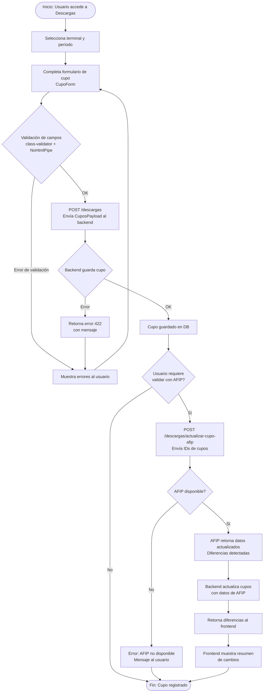

# Flujo: Carga de Cupo con Validación AFIP

> **Módulos involucrados:** [[modulo-descargas]], AFIP (externo)
> **Tipo:** Proceso de integración

## Diagrama de Flujo

## Servicios invocados

| Paso | Verbo | Endpoint | Payload |
|---|---|---|---|
| Guardar cupo | POST | `/descargas` | `CuposPayload` |
| Validar con AFIP | POST | `/descargas/actualizar-cupo-afip` | `{ cupos: [id1, id2, ...] }` |

## Entidades afectadas

- **Escribe:** [[entidad-cupo]]
- **Lee:** API externa AFIP

## Riesgos

- 🔴 Si AFIP no responde, el mensaje de error es genérico y no orientativo para el usuario.
- ⚠️ No se documenta un mecanismo de retry automático en caso de fallo de AFIP.
