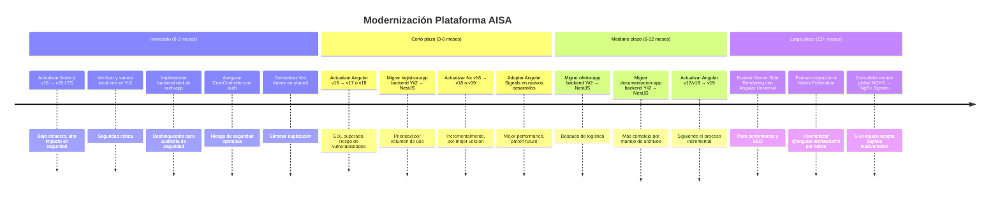

# Recomendaciones de Modernización

> **Última revisión:** 2026-04-29

## Hoja de Ruta Recomendada

## Recomendaciones Detalladas

### 1. Migración Angular v16 → v17/v18 (incremental)

**Contexto:** Angular 16 está en EOL desde noviembre 2024. Sin actualizaciones de seguridad.
**Pasos:**
1. Usar `ng update @angular/core@17` para migrar a v17.
2. Después migrar a v18 siguiendo el mismo proceso.
3. Aprovechar la migración para adoptar **functional guards** (reemplazar class guards) y `inject()`.
4. Los MFEs se pueden migrar **uno a la vez** gracias a Module Federation.

### 2. Migración backends Yii2 → NestJS

**Orden recomendado:** logística → oferta → documentación (de menor a mayor complejidad).
**Estrategia:** Strangler Fig Pattern — levantar el nuevo backend NestJS en paralelo y migrar endpoints gradualmente, redirigiendo desde el frontend Angular.

Para cada migración:
1. Crear nuevo proyecto NestJS en `<app>/backend-nestjs/`.
2. Replicar modelos Sequelize desde los modelos ActiveRecord PHP.
3. Crear migraciones Sequelize para las tablas existentes.
4. Migrar los controladores uno a uno, comenzando por los de solo lectura.
5. Actualizar el frontend Angular para apuntar al nuevo backend.
6. Decommission del backend Yii2.

### 3. Centralizar autenticación

**Problema:** El backend de auth-app es un stub y no hay documentación de dónde ocurre la autenticación real.
**Recomendación:**
- Crear un microservicio dedicado de autenticación en NestJS con `@nestjs/jwt` y `@nestjs/passport`.
- Unificar la validación de JWT en todos los backends NestJS mediante un `AuthModule` compartido.
- Integrar los backends Yii2 con el mismo JWT durante la migración.

### 4. Adoptar Angular Signals y Standalone Components

**En nuevos desarrollos:**
- Usar `standalone: true` en todos los componentes nuevos.
- Usar `signal()`, `computed()`, `effect()` en lugar de NGXS para estado local.
- Usar `takeUntilDestroyed()` de `@angular/core/rxjs-interop` en lugar de `@ngreat/until-destroy`.

### 5. Mejorar observabilidad y logging

- Implementar logging estructurado (JSON) en NestJS con `@nestjs/common` Logger o `pino`.
- Verificar que el `LoggingInterceptor` no logea datos sensibles (tokens, contraseñas, datos personales).
- Agregar health checks HTTP (`/health`) en todos los backends NestJS.
- Integrar con sistema de monitoring (DataDog, Grafana, etc.) — ⚠️ Pendiente de definir según infraestructura.
