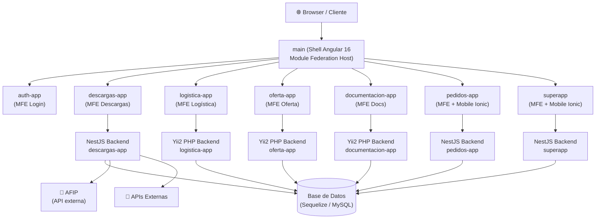

# Plataforma AISA — `full-platform-main`

> **Stack:** Angular 16 · NestJS 10 · Yii2 (PHP) · Nx 16 · NGXS · Sequelize · Angular Material / Vex
> **Versión del repo:** `0.0.0` (monorepo)
> **Última revisión:** 2026-04-29

---

> [!info] Propósito
> Repositorio centralizado (Nx monorepo) que agrupa todos los microfrontends y microservicios de la plataforma AISA. Gestiona el ciclo completo de operaciones de granos: descargas, logística, ofertas, documentación, pedidos y autenticación. Cada app funciona de forma autónoma y se integra al shell principal mediante Module Federation.

---

## 🗂️ Módulos Principales

| # | Módulo | Descripción breve | Criticidad | Enlace |
|---|--------|-------------------|------------|--------|
| 1 | Main Shell | Host de Module Federation, enruta a todos los microfrontends | 🔴 Alta | [[modulo-main-shell]] |
| 2 | Auth App | Autenticación y sesión de usuarios | 🔴 Alta | [[modulo-auth]] |
| 3 | Descargas App | Gestión de cupos, descargas, carta porte y adendas | 🔴 Alta | [[modulo-descargas]] |
| 4 | Logística App | Viajes, cargas, choferes, equipos y derivaciones | 🟡 Media | [[modulo-logistica]] |
| 5 | Oferta App | Tablero de ofertas y gestión de ofertas | 🟡 Media | [[modulo-oferta]] |
| 6 | Documentación App | Gestión de documentos, categorías y vencimientos | 🟡 Media | [[modulo-documentacion]] |
| 7 | Pedidos App | Pedidos (backend NestJS + mobile Ionic) | 🟡 Media | [[modulo-pedidos]] |
| 8 | SuperApp | App general con frontend, mobile y backend | 🟡 Media | [[modulo-superapp]] |
| 9 | Shared | Librerías compartidas: auth, global-setting, ux-components | 🟢 Baja | [[modulo-shared]] |

---

## 🔗 Inventarios Rápidos

- [[tree-estructura-archivos]] — Árbol completo del monorepo
- [[cross-module-dependencies]] — Grafo de dependencias entre módulos
- [[depends-matrix]] — Matriz NxN de dependencias
- [[functional-classification]] — Clasificación funcional de cada módulo
- [[core-vs-custom-dependencies]] — Dependencias core vs. customizaciones
- [[security-inventory]] — Inventario de seguridad y hallazgos
- [[data-files-index]] — Índice de archivos de datos, seeds y configs

---

## 🏗️ Arquitectura de Alto Nivel

---

## 📖 Convenciones de la Documentación

### Leyenda de íconos

| Ícono | Significado |
|-------|-------------|
| 🟢 | Sano / Bajo riesgo |
| 🟡 | Atención / Riesgo medio |
| 🔴 | Crítico / Alto riesgo |
| ⚠️ | Advertencia puntual |
| 🚧 | En construcción / sin verificar |
| 💀 | Código muerto / sin uso detectado |
| 🔒 | Afecta seguridad |
| 📦 | Dependencia externa |
| 🔄 | Proceso automático / batch |
| 📊 | Reporte |
| 🧙 | Wizard / asistente |
| 🔌 | Integración con sistema externo |

### Navegación

- Los enlaces `[[nombre-archivo]]` funcionan en **Obsidian** con navegación bidireccional.
- Cada módulo tiene su archivo en `01-modulos/`.
- Cada funcionalidad detallada en `02-funcionalidades/`.
- Servicios backend documentados en `03-servicios-backend/`.
- Entidades de datos en `04-modelo-de-datos/`.

### Cómo contribuir

1. Al documentar un módulo nuevo, seguir la plantilla de `01-modulos/`.
2. Referenciar siempre el archivo fuente con ruta relativa al repo.
3. Marcar con `⚠️ Pendiente de verificar` lo no confirmado en código.
4. Agregar el módulo nuevo a la tabla de este `README.md`.
