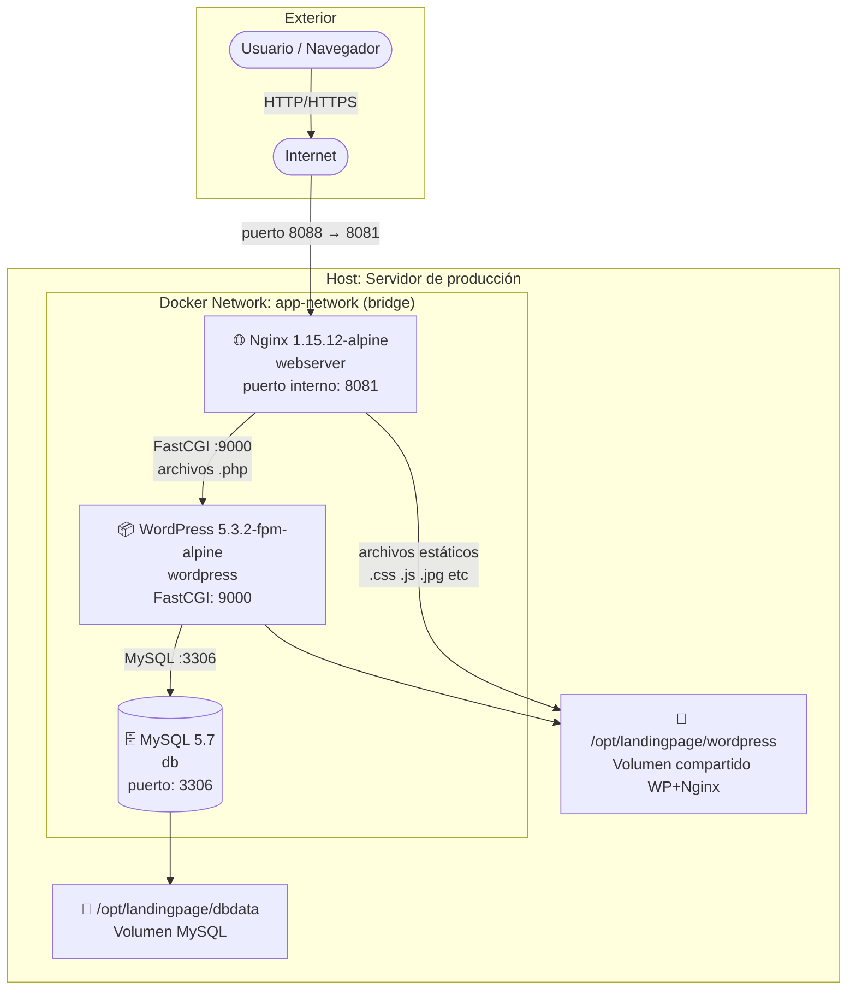

# Arquitectura de Alto Nivel — Landing Site Muvin

## Diagrama de capas

## Descripción de cada capa

### 🌐 Capa de presentación — Nginx

- **Imagen:** `nginx:1.15.12-alpine`
- **Puerto expuesto:** `8088` (host) → `8081` (contenedor)
- **Responsabilidades:**
  - Servir archivos estáticos (CSS, JS, imágenes) directamente desde el volumen compartido.
  - Hacer proxy FastCGI a WordPress para archivos `.php`.
  - Aplicar endurecimiento de seguridad perimetral (headers HTTP, restricciones de IP, bloqueo de rutas sensibles).
- **Configuración:** `nginx-conf/nginx.conf`

### 🧠 Capa de lógica / CMS — WordPress

- **Imagen:** `wordpress:5.3.2-fpm-alpine`
- **Protocolo:** FastCGI en puerto `9000`
- **Responsabilidades:**
  - Renderizar páginas PHP dinámicas.
  - Gestionar contenido via panel `/wp-admin`.
  - Ejecutar plugins (backups, SEO, etc.).
- **Volumen:** `/opt/landingpage/wordpress` (compartido con Nginx)

### 🗄️ Capa de datos — MySQL

- **Imagen:** `mysql:5.7`
- **Base de datos:** `wordpress`
- **Autenticación:** `mysql_native_password`
- **Persistencia:** `/opt/landingpage/dbdata`
- **Hostname interno:** `db-muvinapp-prd`

### 🔧 Capa de orquestación — Docker Compose

- Gestiona el ciclo de vida de los tres servicios con `restart: unless-stopped`.
- Define la red interna `app-network` de tipo `bridge`.
- Carga variables sensibles desde archivo `.env`.
