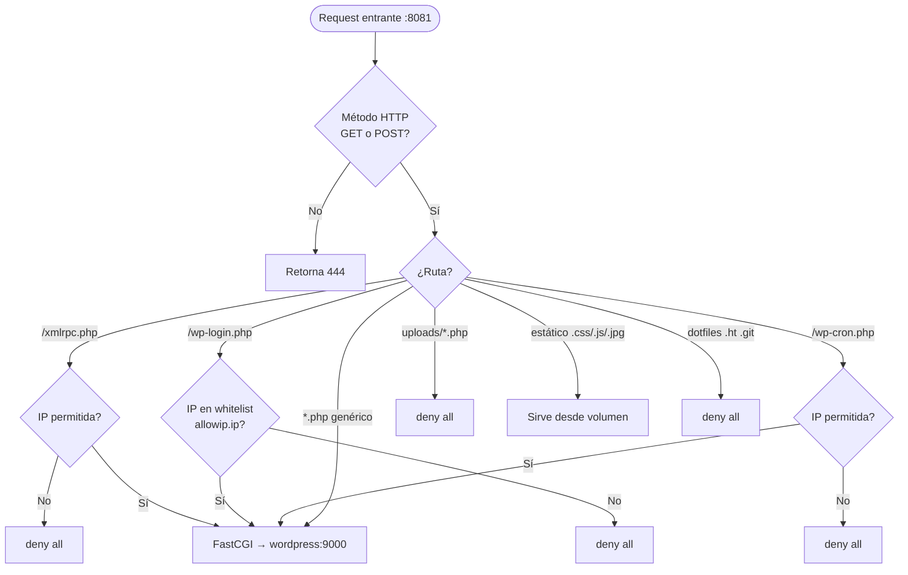

# Módulo: Nginx Webserver

> **Imagen Docker:** `nginx:1.15.12-alpine`
> **Hostname interno:** `web-muvinapp-prd`
> **Puerto expuesto:** `8088` (host) → `8081` (contenedor, escucha en `8081`)
> **Criticidad:** 🟡 Media
> **Estado:** Producción (versión EOL con configuración de seguridad activa)

## Propósito

Nginx actúa como proxy inverso y punto de entrada único del sitio. Es responsable de servir archivos estáticos directamente, delegar peticiones PHP a WordPress vía FastCGI, y aplicar una capa de seguridad perimetral con múltiples reglas de restricción de acceso.

## Funcionalidades que expone

| # | Funcionalidad | Descripción breve |
|---|---------------|-------------------|
| 2.1 | Proxy FastCGI | Reenvía `.php` a `wordpress:9000` |
| 2.2 | Archivos estáticos | Sirve CSS, JS, imágenes con `expires max` |
| 2.3 | Restricción de IP en wp-login | Whitelist de IPs para `/wp-login.php` |
| 2.4 | Bloqueo de xmlrpc | Restringe `/xmlrpc.php` por IP |
| 2.5 | Protección de uploads | Bloquea ejecución PHP en `/uploads` y `/files` |
| 2.6 | Headers de seguridad HTTP | X-Frame-Options, HSTS, X-Content-Type, XSS Protection |
| 2.7 | Restricción de métodos HTTP | Solo permite GET y POST (devuelve 444 el resto) |
| 2.8 | Bloqueo de dotfiles | Niega acceso a `.svn`, `.git`, `.ht`, `.user.ini` |
| 2.9 | Restricción de scripts CGI | Bloquea `.pl`, `.cgi`, `.py`, `.sh`, `.lua` |
| 2.10 | Restricción de backups | Bloquea acceso externo a rutas de backup `.wpress`, `.zip`, `.gz` |

## Dependencias

- **Depende de:** [[modulo-wordpress]] (FastCGI), volumen `/opt/landingpage/wordpress`
- **Es usado por:** usuarios externos vía internet
- **Configuración:** `nginx-conf/nginx.conf` (activa), `nginx-conf/nginx.conf.new` (candidata, inactiva)

## Diagrama de flujo de request

## Rangos de IP permitidos (hardcodeados)

| Rango | Comentario en config |
|-------|---------------------|
| `172.16.0.0/24` | Red interna (BCR) |
| `172.26.0.0/24` | Red interna (BCR) |
| `172.25.0.0/24` | Red interna (BCR) |
| `192.168.12.0/22` | Red interna |
| `172.17.0.12` | Host individual (BCR) |
| `172.17.0.11` | Host individual (BCR) |
| `172.17.0.13` | Host individual (BCR) |
| `allowip.ip` (include) | IPs adicionales desde archivo externo |

## Headers de seguridad HTTP configurados

| Header | Valor configurado |
|--------|------------------|
| `X-Frame-Options` | `SAMEORIGIN` |
| `Strict-Transport-Security` | `max-age=31536000` |
| `X-Content-Type-Options` | `nosniff` |
| `X-XSS-Protection` | `1; mode=block` |
| `server_tokens` | `off` (oculta versión Nginx) |
| `X-Powered-By` (PHP) | Oculto via `fastcgi_hide_header` y `proxy_hide_header` |

## Riesgos y deuda técnica

- 🔴 **Nginx 1.15.12 EOL** — versión de 2019 sin soporte activo.
- 🟡 **Rate limiting de wp-login comentado** — la directiva `limit_req_zone` está comentada, dejando wp-login vulnerable a fuerza bruta (mitigado parcialmente por restricción IP).
- ⚠️ **`nginx.conf.new` no activa** — existe una versión candidata de configuración con diferencias (sin `autoindex off`, sin reglas de updraft). No está claro si debe reemplazar a la actual.
- ⚠️ **Certificado TLS no gestionado aquí** — el puerto expuesto es `8088` sin TLS. Se asume que hay un proxy externo o balanceador que termina TLS. ⚠️ Pendiente de verificar.
- ⚠️ **IPs hardcodeadas en configuración** — los rangos de IP están embebidos en `nginx.conf`. Si cambian las redes internas, hay que actualizar manualmente.
- 🟡 **`autoindex off` ausente en `nginx.conf.new`** — en la versión nueva se removió esta directiva de seguridad. Si se despliega, habilitaría listado de directorios.

## Archivos fuente relevantes

- `nginx-conf/nginx.conf` — configuración activa en producción
- `nginx-conf/nginx.conf.new` — configuración candidata (no desplegada)
- `nginx-conf/allowip.ip` — IPs adicionales para whitelist de wp-login
- `docker-compose.yml` — definición del servicio `webserver`
