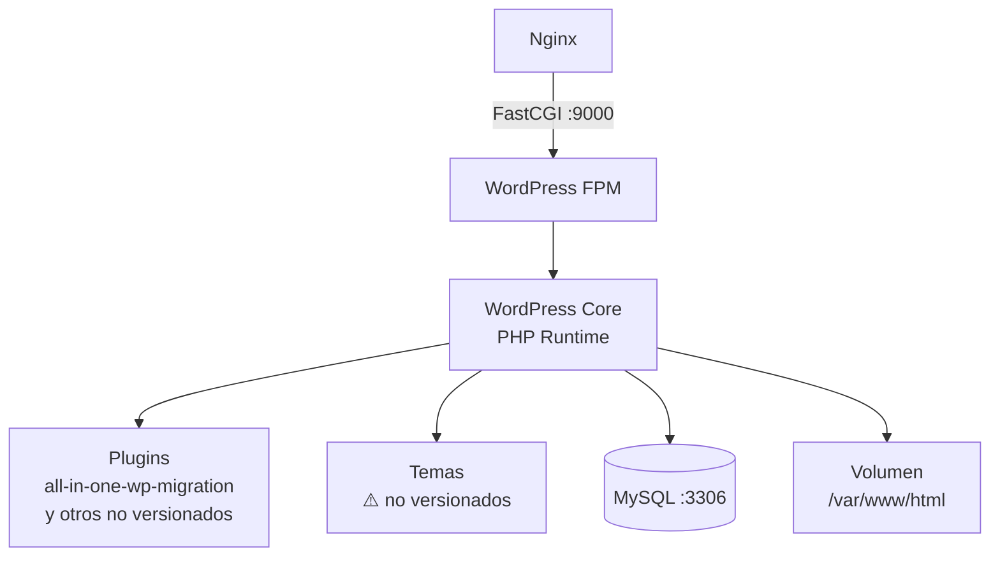

# Módulo: WordPress CMS

> **Imagen Docker:** `wordpress:5.3.2-fpm-alpine`
> **Hostname interno:** `wp-muvinapp-prd`
> **Criticidad:** 🔴 Alta
> **Estado:** Producción (versión desactualizada)

## Propósito

WordPress actúa como el motor central del landing site de Muvin. Gestiona todo el contenido del sitio (páginas, posts, menús, media), expone el panel de administración (`/wp-admin`) para el equipo de marketing/contenido, y ejecuta el runtime PHP mediante FastCGI. Es el componente de mayor superficie de ataque del stack.

## Funcionalidades que expone

| # | Funcionalidad | Descripción breve | Detalle |
|---|---------------|-------------------|---------|
| 1.1 | Renderizado de páginas | Procesa `.php` vía FastCGI y retorna HTML | [[wp-renderizado-paginas]] |
| 1.2 | Panel de administración | `/wp-admin` — gestión de contenido | [[wp-admin]] |
| 1.3 | Sistema de login | `/wp-login.php` — autenticación de administradores | [[wp-login]] |
| 1.4 | XML-RPC API | `/xmlrpc.php` — API legacy de WP | [[wp-xmlrpc]] |
| 1.5 | WP Cron | `/wp-cron.php` — tareas programadas internas | [[wp-cron]] |
| 1.6 | Backup / Migración | Plugin all-in-one-wp-migration v6.77 | [[wp-backup]] |

## Dependencias

- **Depende de:** [[modulo-mysql]] (conexión DB en `db:3306`)
- **Es usado por:** [[modulo-nginx]] (recibe peticiones FastCGI)
- **Consume servicios backend:** ninguno externo identificado en el código versionado

## Diagrama de componentes internos

## Variables de entorno requeridas

| Variable | Fuente | Descripción |
|----------|--------|-------------|
| `WORDPRESS_DB_HOST` | `docker-compose.yml` | `db:3306` |
| `WORDPRESS_DB_USER` | `.env` → `$MYSQL_USER` | Usuario MySQL |
| `WORDPRESS_DB_PASSWORD` | `.env` → `$MYSQL_PASSWORD` | Contraseña MySQL |
| `WORDPRESS_DB_NAME` | `docker-compose.yml` | `wordpress` |
| `SERVER_NAME` | `docker-compose.yml` | `muvinapp.com` |

## Riesgos y deuda técnica

- 🔴 **WordPress 5.3.2 EOL** — versión sin soporte desde hace años. Vulnerabilidades conocidas sin parche.
- 🔴 **PHP ~7.3 EOL** — la imagen base incluye PHP en versión sin soporte activo.
- ⚠️ **Plugins y temas no versionados** — el contenido de `/opt/landingpage/wordpress` no está en el repositorio. No hay visibilidad sobre plugins instalados adicionales.
- ⚠️ **`wp-content/uploads` potencialmente ejecutable** — Nginx bloquea PHP en uploads, pero la configuración real del volumen en producción no es verificable desde el repo.

## Archivos fuente relevantes

- `docker-compose.yml` — definición del servicio `wordpress`
- `nginx-conf/nginx.conf` — configuración FastCGI que apunta al contenedor
