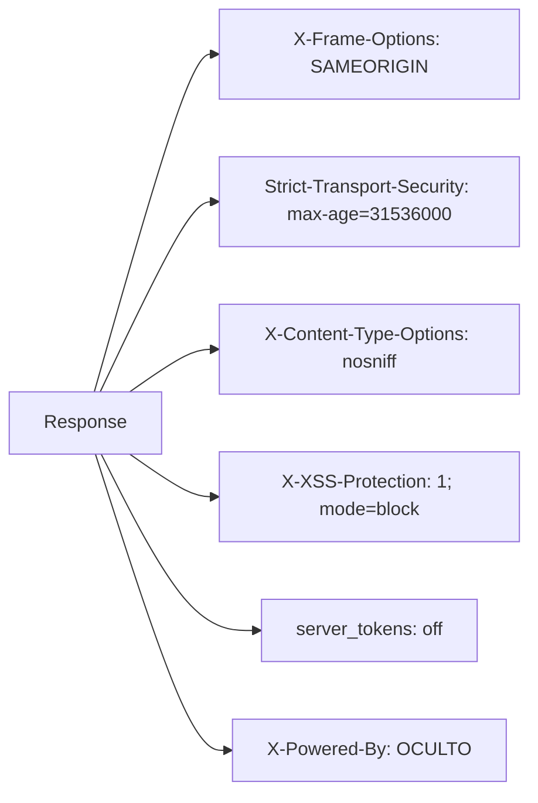

# Funcionalidad: Seguridad Perimetral Nginx

> **Módulo:** [[modulo-nginx]]
> **Ruta UI / Endpoint:** Aplica a todas las rutas del servidor
> **Tipo:** Seguridad

## Descripción funcional

Conjunto de reglas de seguridad configuradas en Nginx que protegen el sitio WordPress de accesos no autorizados, ataques comunes y exposición de información sensible. Incluye restricciones por IP, bloqueo de rutas peligrosas, headers HTTP de seguridad y control de métodos HTTP.

## Precondiciones

- Nginx debe tener acceso de lectura a `nginx-conf/allowip.ip`.
- Las redes internas del servidor deben coincidir con los rangos hardcodeados en `nginx.conf`.

## Reglas de seguridad activas

### Headers HTTP de seguridad



### Restricciones de acceso por ruta

| Ruta | Regla | Severidad si falla |
|------|-------|--------------------|
| `/xmlrpc.php` | Solo IPs internas; deny all | 🔴 |
| `/wp-login.php` | Solo IPs internas + `allowip.ip`; deny all | 🔴 |
| `/wp-cron.php` | Solo IPs internas; deny all | 🟡 |
| `/wp-admin/` | ⚠️ Sin restricción IP en nginx.conf — protegida solo por WP | 🔴 |
| `uploads/*.php` | deny all (evita webshells) | 🔴 |
| `wp-content/*.php` | deny all | 🔴 |
| `wp-includes/*.php` | deny all | 🔴 |
| `akismet/*.php` | deny all | 🟡 |
| `/ai1wm-backups/*.wpress` | Solo IPs internas | 🔴 |
| `/updraft/*.zip` y `.gz` | Solo IPs internas | 🟡 |
| `/.svn`, `/.git` | deny all | 🟡 |
| `/.ht*`, `/.user.ini` | deny all | 🟡 |
| `*.pl, *.cgi, *.py, *.sh, *.lua` | Retorna 444 | 🔴 |

### Restricción de métodos HTTP

```nginx
if ($request_method !~ ^(GET|POST)$ ) {
    return 444;
}
```
Solo se permiten GET y POST. Cualquier otro método (PUT, DELETE, OPTIONS, PATCH, etc.) recibe respuesta `444` (sin respuesta TCP).

## Riesgos específicos

- 🔴 **`/wp-admin/` no tiene restricción IP** — a diferencia de `wp-login.php`, el directorio `/wp-admin/` completo no está restringido por IP en Nginx. Cualquier IP puede acceder al panel (protegido solo por la autenticación de WordPress).
- 🟡 **Rate limiting comentado** — `limit_req_zone` para `wp-login.php` está comentado en el archivo. Sin rate limiting activo, wp-login es vulnerable a ataques de fuerza bruta por IPs no whitelisteadas ⚠️ (aunque el bloqueo IP mitiga esto).
- ⚠️ **`nginx.conf.new` sin `autoindex off`** — si se despliega esta versión, se habilitaría el listado de directorios.
- 🟡 **HSTS sin `includeSubDomains` ni `preload`** — el header HSTS es básico. No cubre subdominios.
- ⚠️ **TLS no termina en Nginx** — no hay configuración SSL/TLS en el archivo. Se asume proxy externo. Pendiente de verificar.

## Archivos fuente relevantes

- `nginx-conf/nginx.conf` (líneas 7-13 headers, 31-183 reglas)
- `nginx-conf/allowip.ip` — whitelist adicional de IPs para wp-login
