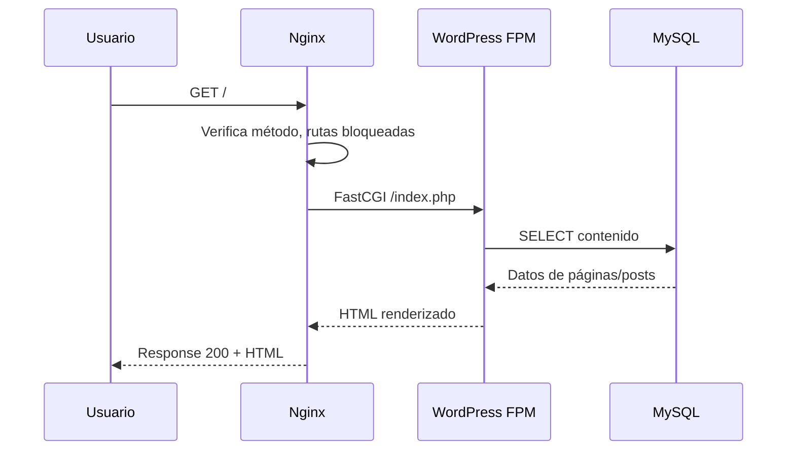

# Endpoints WordPress — Landing Site Muvin

## `POST /wp-login.php` {#wp-login}

**Propósito:** Autenticación de usuarios administradores de WordPress.
**Autenticación:** Formulario usuario/contraseña. Sin 2FA visible en configuración.
**Restricción Nginx:** Solo IPs internas + `allowip.ip`. Deny all para el resto.
**Consumido por:** Administradores del sitio.

### Riesgos

- 🔴 Sin rate limiting activo (comentado en nginx.conf).
- 🟡 Sin 2FA configurado en la capa de infraestructura.

---

## `POST /xmlrpc.php` {#xmlrpc}

**Propósito:** API XML-RPC legacy de WordPress. Permite publicar contenido, gestionar comentarios remotamente.
**Autenticación:** Usuario/contraseña en cada llamada.
**Restricción Nginx:** Solo IPs internas. Deny all para el resto.
**Consumido por:** ⚠️ Pendiente de verificar — no hay cliente identificado en el código versionado.

### Riesgos

- 🔴 XML-RPC es vector conocido de ataques (brute force amplificado, SSRF). Restringir o deshabilitar si no se usa activamente.

---

## `GET /wp-cron.php` {#wp-cron}

**Propósito:** Ejecuta tareas programadas internas de WordPress (envío de emails, actualizaciones, etc.).
**Autenticación:** Ninguna (acceso por URL).
**Restricción Nginx:** Solo IPs internas. Deny all para el resto.
**Consumido por:** Scheduler interno de WordPress / llamadas desde servidor.

---

## `GET /wp-admin/*` {#wp-admin}

**Propósito:** Panel de administración completo de WordPress.
**Autenticación:** Sesión WordPress (cookie).
**Restricción Nginx:** ⚠️ **Sin restricción IP** — cualquier IP puede acceder a la ruta. La protección depende únicamente del login de WordPress.
**Consumido por:** Administradores del sitio.

### Riesgos

- 🔴 Superficie de ataque expuesta públicamente. A diferencia de `wp-login.php`, no hay whitelist IP en Nginx para `/wp-admin/`.

---

## `GET|POST /*` — Páginas públicas {#publico}

**Propósito:** Servir el contenido público del landing site (home, landing pages, blog si aplica).
**Autenticación:** Ninguna.
**Restricción Nginx:** Solo GET y POST permitidos.
**Consumido por:** Usuarios anónimos en internet.

### Flujo

