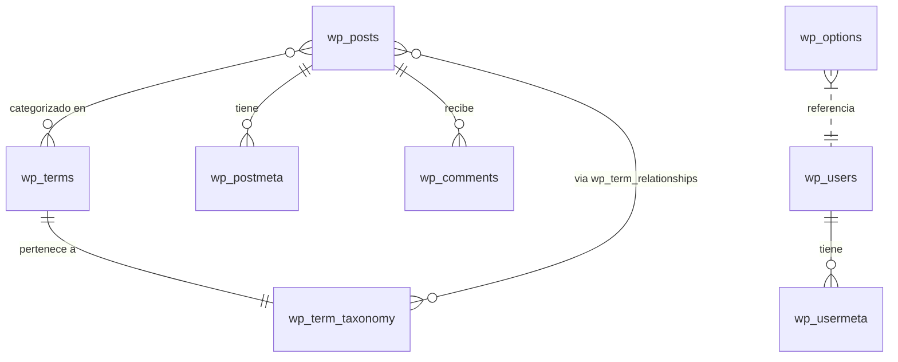

# Índice de Entidades — Landing Site Muvin

> [!info]
> El modelo de datos es el esquema estándar de WordPress (`wordpress` DB). No hay tablas personalizadas identificadas en el código versionado. El esquema es generado automáticamente por WordPress en el primer arranque.

## Tablas estándar de WordPress

| Tabla | Propósito |
|-------|-----------|
| `wp_posts` | Páginas, posts, attachments, revisiones |
| `wp_postmeta` | Metadatos de posts/páginas |
| `wp_users` | Usuarios administradores |
| `wp_usermeta` | Metadatos de usuarios (roles, preferencias) |
| `wp_options` | Configuración del sitio (URL, nombre, plugins, temas) |
| `wp_terms` | Categorías y etiquetas |
| `wp_term_taxonomy` | Taxonomías |
| `wp_term_relationships` | Relación posts-taxonomías |
| `wp_comments` | Comentarios (si están habilitados) |
| `wp_commentmeta` | Metadatos de comentarios |
| `wp_links` | Links (feature deprecada de WP) |

> [!warning]
> No hay scripts SQL de inicialización versionados en el repositorio. El esquema se crea automáticamente al iniciar WordPress por primera vez. Para auditar el esquema real, acceder al contenedor MySQL en producción.

## Diagrama ER simplificado

