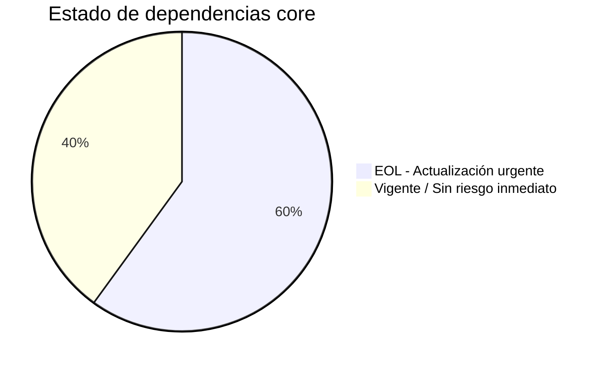

# Core vs Dependencias Customizadas — Landing Site Muvin

## Dependencias "core / vendor estándar"

| Dependencia | Versión | Propósito | Alternativa moderna | Bloqueada? |
|-------------|---------|-----------|---------------------|-----------|
| `mysql:5.7` (imagen Docker Hub) | 5.7 | Base de datos | MySQL 8.x / MariaDB 10.x / PostgreSQL | 🟡 No bloqueada — migración posible con dump+restore |
| `wordpress:5.3.2-fpm-alpine` (imagen Docker Hub) | 5.3.2 | CMS + PHP runtime | WordPress 6.x con PHP 8.x | 🟡 No bloqueada — actualización directa posible con backup |
| `nginx:1.15.12-alpine` (imagen Docker Hub) | 1.15.12 | Webserver / proxy | nginx:1.25-alpine o nginx:latest-alpine | 🟢 No bloqueada — actualización de imagen simple |
| Docker Compose v3 syntax | 3 | Orquestación | Docker Compose v2 syntax (sin clave `version`) | 🟢 No bloqueada — ajuste de sintaxis |
| `all-in-one-wp-migration` plugin | 6.77 | Backup WordPress | Versión actual del plugin / UpdraftPlus | 🟡 No bloqueada — actualizar plugin |

## Dependencias customizadas / propias

| Customización | Archivo | Descripción | Alternativa |
|---------------|---------|-------------|-------------|
| Configuración Nginx hardeneada | `nginx-conf/nginx.conf` | Reglas de seguridad, restricciones IP, headers HTTP | Mantener y actualizar |
| Whitelist de IPs | `nginx-conf/allowip.ip` | Lista de IPs permitidas para wp-login | Externalizar a variables de entorno o configuración dinámica |
| Variables de entorno | `.env` | Credenciales de base de datos | Docker Secrets / Vault / AWS SSM |
| `nginx.conf.new` | `nginx-conf/nginx.conf.new` | Versión candidata de configuración | Eliminar o unificar con la activa |

## Resumen de riesgos de dependencias

> [!danger] Tres dependencias core en EOL
> WordPress 5.3.2, MySQL 5.7 y Nginx 1.15.12 están todas sin soporte activo. Ninguna está "bloqueada" técnicamente — la actualización es factible y debería priorizarse como deuda técnica crítica.
