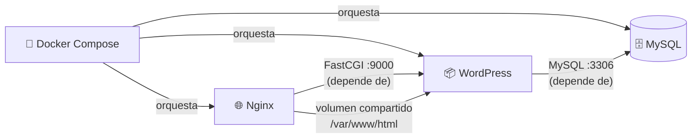

# Dependencias entre Módulos — Landing Site Muvin

## Diagrama de dependencias



## Descripción de dependencias

| Módulo origen | Módulo destino | Tipo de dependencia | Descripción |
|---------------|----------------|---------------------|-------------|
| [[modulo-nginx]] | [[modulo-wordpress]] | Llamada de red (FastCGI) | Nginx delega `.php` a WordPress FPM por FastCGI en puerto 9000 |
| [[modulo-nginx]] | [[modulo-wordpress]] | Volumen compartido | Nginx y WordPress montan el mismo directorio `/var/www/html` para servir estáticos |
| [[modulo-wordpress]] | [[modulo-mysql]] | Conexión de base de datos | WordPress se conecta a MySQL en `db:3306` para toda la persistencia |
| [[modulo-docker-compose]] | [[modulo-nginx]] | Orquestación | Docker Compose define, inicia y gestiona el servicio Nginx |
| [[modulo-docker-compose]] | [[modulo-wordpress]] | Orquestación | Docker Compose define, inicia y gestiona el servicio WordPress |
| [[modulo-docker-compose]] | [[modulo-mysql]] | Orquestación | Docker Compose define, inicia y gestiona el servicio MySQL |

## Dependencias problemáticas / circulares

No hay dependencias circulares entre módulos. El grafo es un DAG (grafo acíclico dirigido) lineal:

```
Docker Compose → Nginx → WordPress → MySQL
```

## Dependencias transitivas

- **Nginx depende transitivamente de MySQL** — si MySQL está caído, WordPress no puede renderizar páginas dinámicas, y Nginx recibirá errores 502/504 de FastCGI.
