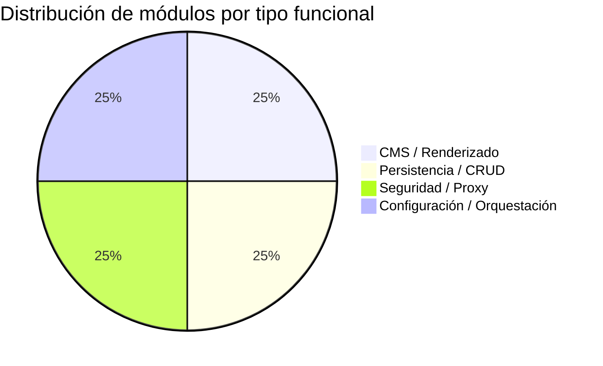

# Clasificación Funcional de Módulos — Landing Site Muvin

## Tabla de clasificación

| Módulo | Tipo funcional | Descripción |
|--------|---------------|-------------|
| [[modulo-wordpress]] | CMS / Renderizado | Motor de contenido, procesa páginas PHP, expone panel de admin |
| [[modulo-mysql]] | Persistencia / CRUD | Almacenamiento relacional de todo el contenido WordPress |
| [[modulo-nginx]] | Seguridad / Proxy | Proxy inverso con endurecimiento de seguridad perimetral |
| [[modulo-docker-compose]] | Configuración / Orquestación | Define y orquesta el stack completo de servicios |

## Distribución por tipo funcional

## Clasificación de funcionalidades

| Funcionalidad | Módulo | Tipo |
|---------------|--------|------|
| Renderizado de páginas públicas | WordPress | Renderizado |
| Panel de administración `/wp-admin` | WordPress | CRUD / Configuración |
| Login `/wp-login.php` | WordPress | Seguridad |
| XML-RPC API | WordPress | Integración (legacy) |
| WP Cron | WordPress | Batch |
| Backup / Migración | WordPress | Utilitario |
| Seguridad perimetral | Nginx | Seguridad |
| Servicio de archivos estáticos | Nginx | Utilitario |
