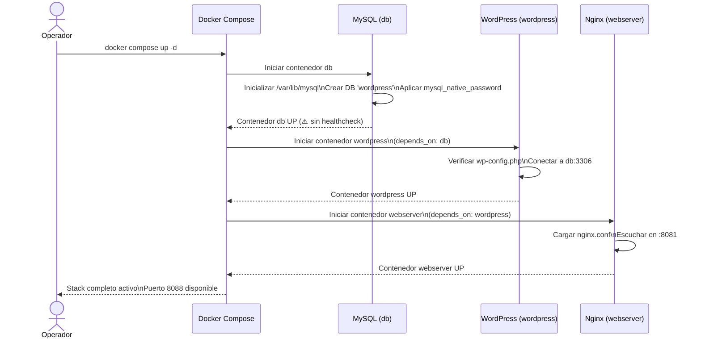

# Flujo: Arranque del Stack Docker Compose

> **Módulos:** [[modulo-docker-compose]] → [[modulo-mysql]] → [[modulo-wordpress]] → [[modulo-nginx]]

## Diagrama de arranque



## Riesgo: race condition en arranque

> [!warning] Race condition MySQL / WordPress
> `depends_on: db` en Docker Compose espera que el **contenedor** esté corriendo, no que MySQL esté listo para aceptar conexiones. Si MySQL tarda en inicializarse (primera vez, volumen vacío), WordPress puede fallar al conectarse y crashear. Docker Compose lo reiniciará (política `unless-stopped`) hasta que MySQL esté disponible.
>
> **Solución recomendada:** Agregar `healthcheck` al servicio `db` con `mysqladmin ping`.

## Prerequisitos en el host

```
/opt/landingpage/dbdata/       # debe existir (o Docker lo crea vacío)
/opt/landingpage/wordpress/    # debe existir con WordPress instalado o imagen lo inicializa
.env                           # debe estar presente con las 3 variables de credenciales
```
