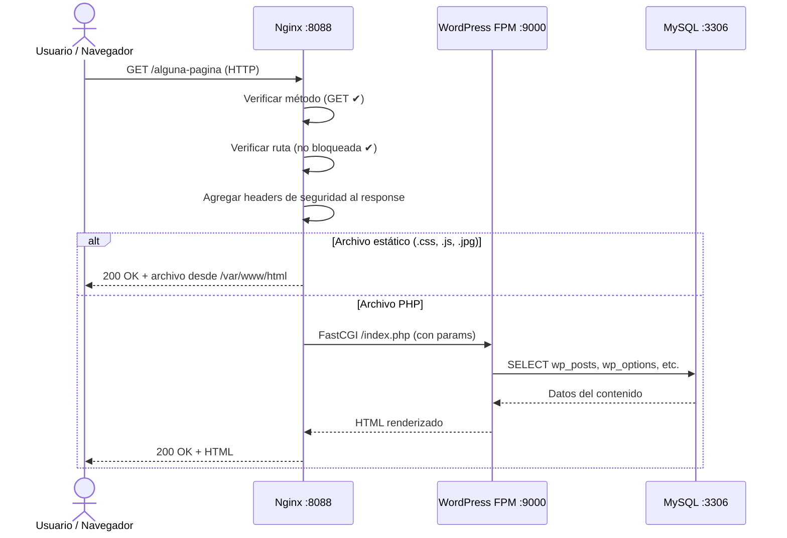
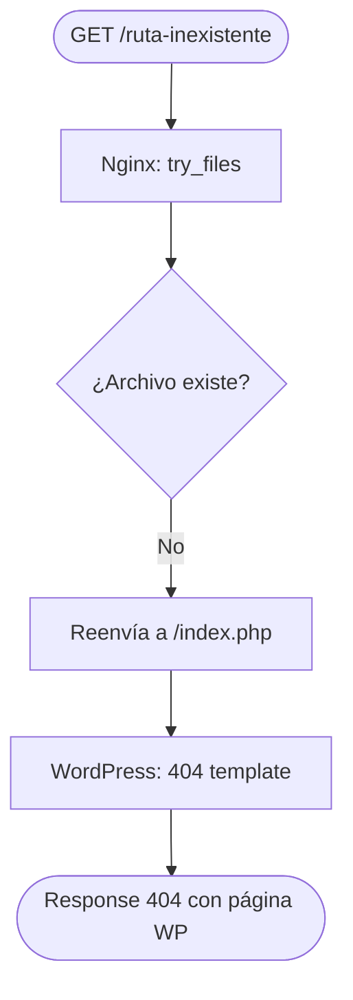

# Flujo: Solicitud de Página Pública

> **Módulos:** [[modulo-nginx]] → [[modulo-wordpress]] → [[modulo-mysql]]
> **Tipo:** Request HTTP sincrónico

## Diagrama de secuencia

## Flujo alternativo — Ruta no encontrada

