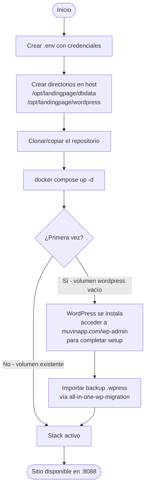

# Build y Despliegue — Landing Site Muvin

## No hay proceso de build

El proyecto no tiene código fuente que compilar. Usa imágenes Docker públicas de Docker Hub. El "despliegue" consiste en levantar el stack con Docker Compose.

## Proceso de despliegue (primera vez)

## Comandos operativos

| Operación | Comando | Notas |
|-----------|---------|-------|
| Iniciar stack | `docker compose up -d` | Desde el directorio del proyecto |
| Detener stack | `docker compose down` | No elimina volúmenes |
| Ver logs | `docker compose logs -f` | Todos los servicios |
| Logs de un servicio | `docker compose logs -f webserver` | |
| Reiniciar un servicio | `docker compose restart wordpress` | |
| Ver estado | `docker compose ps` | |
| Actualizar imagen y redesplegar | `docker compose pull && docker compose up -d` | ⚠️ Ver sección de actualización |

## Actualización de versiones (procedimiento recomendado)

1. Hacer backup completo con `all-in-one-wp-migration` antes de cualquier actualización.
2. Actualizar la versión de la imagen en `docker-compose.yml`.
3. `docker compose pull` para descargar la nueva imagen.
4. `docker compose up -d` para recrear los contenedores.
5. Verificar el sitio en el navegador.
6. Si hay problemas: `docker compose down && docker compose up -d` con la versión anterior.

## Rollback

## Archivos fuente relevantes

- `docker-compose.yml` — definición completa del stack
- `.env` — credenciales (no versionado)
- `nginx-conf/nginx.conf` — configuración de producción
