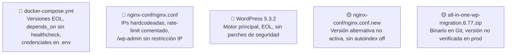

# Hotspots — Landing Site Muvin

> Archivos y configuraciones con mayor concentración de riesgos o complejidad.

## Mapa de hotspots

## Tabla de hotspots

| Archivo/Componente | Riesgo principal | Severidad | Cambios recomendados |
|-------------------|-----------------|-----------|---------------------|
| `docker-compose.yml` | Versiones EOL de todas las imágenes | 🔴 | Actualizar imágenes WordPress, MySQL, Nginx |
| `nginx-conf/nginx.conf` | /wp-admin sin restricción IP; rate-limit comentado | 🔴 | Agregar bloque location para /wp-admin; activar rate-limit |
| WordPress 5.3.2 | EOL, CVEs sin parchear | 🔴 | Actualizar a WordPress 6.x |
| MySQL 5.7 | EOL desde Oct 2023 | 🔴 | Migrar a MySQL 8.x |
| `.env` | Credenciales en texto plano | 🔴 | Implementar secrets management |
| `nginx-conf/nginx.conf.new` | Estado incierto, sin autoindex off | 🟡 | Definir si reemplaza o se descarta |
| `all-in-one-wp-migration.6.77.zip` | Binario en Git | 🟡 | Eliminar del repo |
