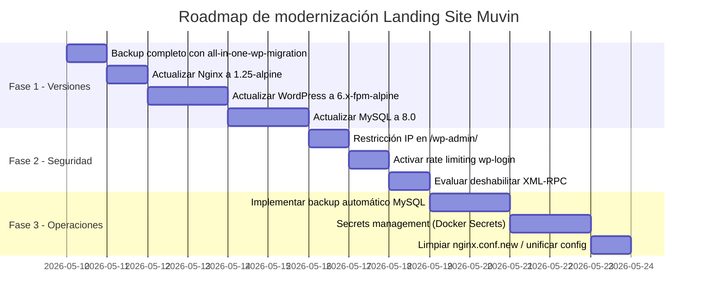

# Recomendaciones de Modernización — Landing Site Muvin

> Propuesta fundamentada de camino de mejora. No implica refactorización completa, sino actualizaciones incrementales de bajo riesgo.

## Fase 1 — Actualización de versiones (urgente, ~1-2 días)

## Fase 1 — Actualización de versiones (urgente)

| Acción | Riesgo | Procedimiento resumido |
|--------|--------|----------------------|
| Nginx → 1.25-alpine | 🟢 Bajo | Cambiar imagen en `docker-compose.yml`, `docker compose up -d` |
| WordPress → 6.x-fpm-alpine | 🟡 Medio | Backup previo → cambiar imagen → verificar plugins/temas |
| MySQL → 8.0 | 🟡 Medio | Dump previo → cambiar imagen → ajustar auth plugin → restaurar |

## Fase 2 — Hardening de seguridad (~2-3 días)

1. **Agregar restricción IP a `/wp-admin/`** — ver [[deuda-tecnica#DT-04]].
2. **Activar rate limiting** en `wp-login.php` descomentando las líneas en `nginx.conf`.
3. **Evaluar XML-RPC** — si no hay clientes activos, deshabilitar con plugin o bloquear totalmente en Nginx.
4. **Agregar `autoindex off`** a `nginx.conf.new` y decidir si reemplaza a `nginx.conf`.

## Fase 3 — Mejoras operativas (~1 semana)

1. **Backup automático de MySQL** — agregar un cronjob o servicio Docker que ejecute `mysqldump` periódicamente y guarde en almacenamiento externo (S3, NFS, etc.).
2. **Secrets management** — migrar de `.env` en texto plano a Docker Secrets o variables de entorno inyectadas por CI/CD.
3. **Monitoreo** — agregar healthchecks en `docker-compose.yml` y considerar integración con un sistema de alertas (UptimeRobot, Grafana, etc.).

## Consideración a largo plazo

> [!info] ¿Vale la pena seguir en WordPress?
> Si el equipo tiene capacidades frontend modernas, una alternativa es migrar el landing site a un generador de sitios estáticos (Next.js, Astro, Hugo) con un CMS headless (Contentful, Sanity, Strapi). Esto eliminaría la superficie de ataque de WordPress y simplificaría el stack. Sin embargo, implica migración de contenido y cambio de proceso editorial.
>
> Dado el alcance del proyecto (landing page informativa), esta opción tiene relación costo/beneficio favorable si hay recursos disponibles.
