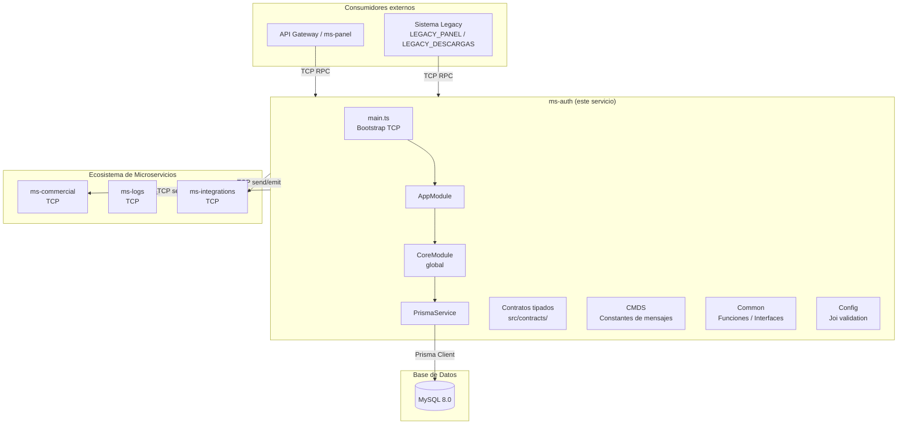
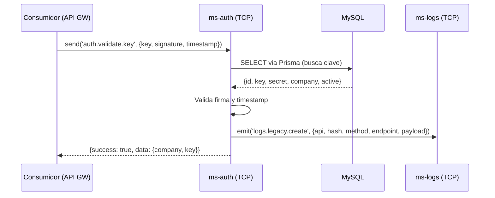

# Arquitectura de Alto Nivel

> **Proyecto:** muvin-ms-auth
> **Última revisión:** 2026-04-27

---

## Diagrama general

---

## Capas del sistema

### 1. Capa de transporte (TCP Microservices)

`ms-auth` expone su interfaz exclusivamente mediante **transporte TCP** usando el módulo `@nestjs/microservices`. No tiene endpoints HTTP propios. Los mensajes siguen el patrón RPC (`send` para request/response) y eventos (`emit` para fire-and-forget).

- **Host y puerto** configurados desde variables de entorno (`HOST`, `PORT=4001`).
- Los comandos disponibles están definidos como constantes en `src/common/cmd/constant.ts` (objeto `CMDS`).

### 2. Capa de contratos

Define el **protocolo de comunicación tipado** entre microservicios. Ubicada en `src/contracts/`, contiene:

- **Tipos base:** `TContractSend<Content, Response>` y `TContractEmit<Content>` en `contracts/types.ts`.
- **Contratos por dominio:** `auth/`, `commercial/`, `logs/`, `integrations/` — cada uno con sus interfaces de payload y respuesta.
- El microservicio es tanto **proveedor** (expone comandos `auth.*`) como **consumidor** (invoca comandos de `commercial.*`, `logs.*`, `integrations.*`).

### 3. Capa de negocio (handlers)

> [!warning] No implementada
> Los handlers RPC que procesan los mensajes TCP **no están implementados** en este repositorio. Los contratos definen la interfaz, pero la lógica de negocio está pendiente. Ver [[deuda-tecnica]].

### 4. Capa de datos (Prisma + MySQL)

- `PrismaService` (en `src/core/services/prisma.ts`) extiende `PrismaClient` y se conecta a MySQL al iniciar el módulo.
- Es un **provider global** exportado por `CoreModule`, disponible para inyección en cualquier módulo hijo.
- El esquema está definido en `prisma/schema.prisma`. Las migraciones no están versionadas.

### 5. Capa de configuración

- Variables de entorno validadas con **Joi** al arrancar en `src/config/environments.ts`.
- Si alguna variable requerida falta, el proceso falla en el arranque (fail-fast).

---

## Diagrama de secuencia — flujo típico de validación

> [!warning] Este diagrama es el flujo esperado según los contratos definidos. La implementación real de los handlers no existe aún.

---

## Topología de red esperada

| Servicio | Transporte | Puerto típico |
|----------|------------|---------------|
| ms-auth (este) | TCP | 4001 |
| ms-commercial | TCP | ⚠️ Pendiente de verificar |
| ms-logs | TCP | ⚠️ Pendiente de verificar |
| ms-integrations | TCP | ⚠️ Pendiente de verificar |

---

## Decisiones arquitecturales relevantes

| Decisión | Justificación | Riesgo |
|----------|---------------|--------|
| Transporte TCP | Latencia baja, comunicación síncrona entre servicios internos | 🟡 Sin discovery automático — IPs hardcodeadas en config |
| Prisma como ORM | Tipado fuerte, migraciones gestionadas, soporte MySQL | 🟢 Bajo |
| Módulo global para Prisma | Evitar re-instanciación del cliente por módulo | 🟢 Bajo |
| Contratos tipados compartidos | Contrato explícito entre microservicios, detecta roturas en compile-time | 🟢 Bajo |
| Validación Joi en bootstrap | Falla rápido si faltan variables críticas | 🟢 Bajo |
| Sin HTTP / REST | Microservicio puro — no expone API pública directamente | 🟡 Dificulta testing manual y debugging |
