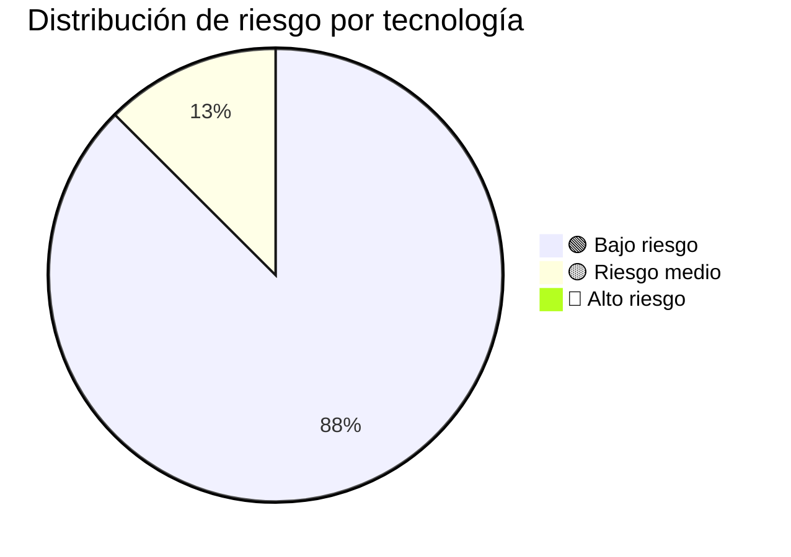

# Stack Tecnológico

> **Proyecto:** muvin-ms-auth
> **Última revisión:** 2026-04-27

---

## Runtime y lenguaje

| Tecnología | Versión | Propósito | Estado vendor | Riesgo |
|------------|---------|-----------|---------------|--------|
| Node.js | 20 (Alpine) | Runtime de ejecución | ✅ LTS activo hasta 2026-04 | 🟢 Bajo |
| TypeScript | 5.9.3 | Lenguaje principal con tipado estático | ✅ Vigente | 🟢 Bajo |

---

## Framework y librerías core

| Tecnología | Versión | Propósito | Estado vendor | Riesgo |
|------------|---------|-----------|---------------|--------|
| NestJS | 11.1.9 | Framework principal del microservicio | ✅ Vigente | 🟢 Bajo |
| @nestjs/microservices | 11.1.9 | Soporte para comunicación TCP entre microservicios | ✅ Vigente | 🟢 Bajo |
| @nestjs/common | 11.1.9 | Decoradores, pipes, guards, módulos | ✅ Vigente | 🟢 Bajo |
| @nestjs/core | 11.1.9 | Motor interno de NestJS | ✅ Vigente | 🟢 Bajo |
| rxjs | (peer dep NestJS) | Programación reactiva — usado internamente por NestJS | ✅ Vigente | 🟢 Bajo |
| reflect-metadata | (peer dep NestJS) | Soporte de decoradores TypeScript | ✅ Vigente | 🟢 Bajo |

---

## Base de datos y ORM

| Tecnología | Versión | Propósito | Estado vendor | Riesgo |
|------------|---------|-----------|---------------|--------|
| MySQL | 8.0 | Motor de base de datos relacional | ✅ Vigente (soporte hasta 2026) | 🟡 Medio — planificar migración a 8.4+ |
| Prisma ORM | 6.19.0 | ORM para acceso a datos y migraciones | ✅ Vigente | 🟢 Bajo |
| @prisma/client | 6.19.0 | Cliente generado para queries tipadas | ✅ Vigente | 🟢 Bajo |

---

## Validación y configuración

| Tecnología | Versión | Propósito | Estado vendor | Riesgo |
|------------|---------|-----------|---------------|--------|
| Joi | ⚠️ Pendiente de verificar versión | Validación del esquema de variables de entorno | ✅ Vigente | 🟢 Bajo |

---

## Infraestructura y contenedores

| Tecnología | Versión | Propósito | Estado vendor | Riesgo |
|------------|---------|-----------|---------------|--------|
| Docker | — | Contenedorización del microservicio | ✅ Vigente | 🟢 Bajo |
| Docker Compose | — | Orquestación local (MySQL + ms-auth) | ✅ Vigente | 🟢 Bajo |
| node:20-alpine | 20-alpine | Imagen base del contenedor (multi-stage build) | ✅ Vigente | 🟢 Bajo |

---

## Herramientas de desarrollo

| Tecnología | Versión | Propósito | Estado vendor | Riesgo |
|------------|---------|-----------|---------------|--------|
| ESLint | — | Linting estático del código TypeScript | ✅ Vigente (flat config) | 🟢 Bajo |
| Prettier | — | Formateo automático de código | ✅ Vigente | 🟢 Bajo |
| Husky | — | Git hooks (pre-commit con lint-staged) | ✅ Vigente | 🟢 Bajo |
| lint-staged | — | Ejecuta linters solo sobre archivos staged | ✅ Vigente | 🟢 Bajo |
| NestJS CLI | — | Scaffolding y compilación del proyecto | ✅ Vigente | 🟢 Bajo |

---

## CI/CD

| Tecnología | Propósito | Estado |
|------------|-----------|--------|
| GitHub Actions | Pipelines de deploy y sincronización | ✅ Activo |
| `deploy-dev.yml` | Deploy automático a entorno DEV | 🟢 Activo |
| `sync-cap.yml` | Sincronización con CAP | ⚠️ Pendiente de verificar propósito |

---

## Transporte entre microservicios

| Mecanismo | Descripción | Riesgo |
|-----------|-------------|--------|
| TCP (NestJS Microservices) | Comunicación RPC sincrónica y eventos asíncronos entre microservicios | 🟡 Medio — sin discovery automático, acoplamiento por IP/puerto fijo |

> [!info] Arquitectura de microservicios
> El proyecto forma parte de un ecosistema de microservicios. Este servicio (`ms-auth`) se comunica con al menos 3 otros microservicios: `ms-commercial`, `ms-logs` y `ms-integrations`. Los contratos de comunicación están definidos en `src/contracts/`.

---

## Resumen de riesgo tecnológico

---

## Notas de modernización

- **MySQL 8.0** tiene soporte hasta abril 2026. Evaluar upgrade a 8.4 LTS en el corto plazo.
- **TCP como transporte** es funcional pero limita la observabilidad y el discovery. Evaluar migración a NATS o Redis para mayor resiliencia en el mediano plazo. Ver [[recomendaciones-modernizacion]].
- **Sin tests implementados** — riesgo operativo independiente del stack. Ver [[deuda-tecnica]].

---

## Leyenda

| Ícono | Significado |
|-------|-------------|
| ✅ | Vigente y con soporte activo del vendor |
| ⚠️ | Pendiente de verificar |
| 🟢 | Bajo riesgo |
| 🟡 | Riesgo medio — requiere atención planificada |
| 🔴 | Alto riesgo — acción urgente |
