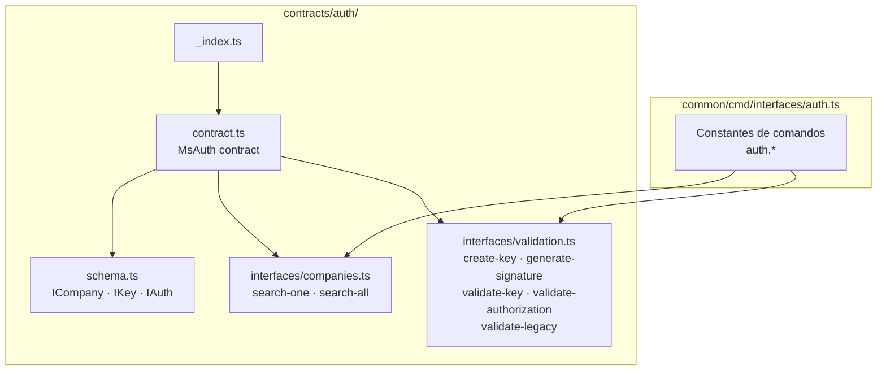

# Módulo: Auth

> **Ruta/Namespace:** `src/contracts/auth/`
> **Criticidad:** 🔴 Alta — es la razón de ser del microservicio
> **Estado:** 🚧 Contrato definido — handlers sin implementar

---

## Propósito

Gestiona la autenticación y autorización del ecosistema Muvin. Expone comandos para validar claves API, generar y verificar firmas criptográficas, y autenticar requests provenientes tanto del sistema moderno como del sistema legacy. También provee consulta de compañías registradas.

---

## Funcionalidades que expone

| # | Funcionalidad | CMD | Descripción breve | Detalle |
|---|---|---|---|---|
| 1.1 | Buscar compañía por ID | `auth.companies.search.one` | Retorna una compañía por su ID | [[auth-companies-search-one]] |
| 1.2 | Buscar múltiples compañías | `auth.companies.search.all` | Retorna varias compañías por sus IDs | [[auth-companies-search-all]] |
| 1.3 | Crear clave API | `auth.create.key` | Genera un par key/secret para una compañía | [[auth-validate-create-key]] |
| 1.4 | Generar firma | `auth.generate.signature` | Genera la firma HMAC para un request | [[auth-validate-generate-signature]] |
| 1.5 | Validar clave API | `auth.validate.key` | Valida key + signature + timestamp | [[auth-validate-key]] |
| 1.6 | Validar autorización | `auth.validate.authorization` | Validación general de autorización | [[auth-validate-authorization]] |
| 1.7 | Validar legacy | `auth.validate.legacy` | Validación compatible con sistema legacy | [[auth-validate-legacy]] |

---

## Dependencias

- **Depende de:** [[modulo-core]] (PrismaService), `common/`
- **Es usado por:** Consumidores externos vía TCP (API Gateway, sistema legacy)
- **Consume servicios backend:** ninguno adicional — es el servicio de autenticación base

---

## Diagrama de componentes internos



---

## Entidades de datos implicadas

[[entidad-company]], [[entidad-key]]

---

## Esquema de entidades (definido en `contracts/auth/schema.ts`)

```typescript
ICompany  { id, cuit, rs }
IKey      { id, key, secret, company, active }
IAuth     { company: ICompany, key: IKey }
```

---

## Riesgos y deuda técnica detectados

- 🔴 Los handlers RPC no están implementados — el módulo no procesa ningún mensaje actualmente.
- 🔴 El campo `secret` de `IKey` debe almacenarse hasheado en BD. Sin implementación no es verificable.
- ⚠️ `validate-legacy` sugiere compatibilidad con un sistema anterior sin documentación de ese protocolo.
- ⚠️ No hay validación de expiración de claves ni TTL de signatures en el contrato.
- 🔒 El mecanismo de firma (HMAC, JWT u otro) no está especificado en los contratos — pendiente de verificar.

---

## Archivos fuente relevantes

- `src/contracts/auth/contract.ts`
- `src/contracts/auth/schema.ts`
- `src/contracts/auth/interfaces/companies.ts`
- `src/contracts/auth/interfaces/validation.ts`
- `src/contracts/auth/_index.ts`
- `src/common/cmd/interfaces/auth.ts`
- `src/common/cmd/constant.ts` (sección `auth`)
