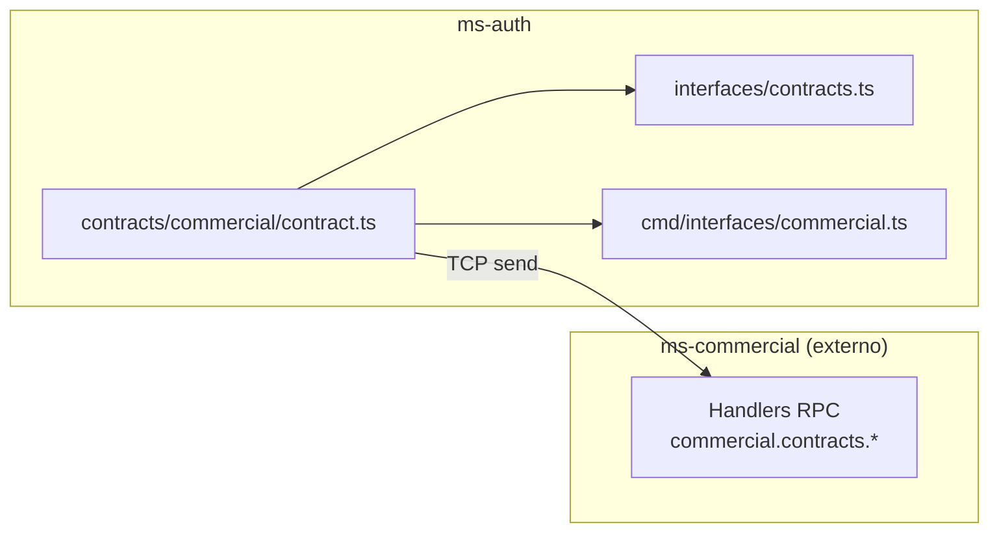

# Módulo: Commercial

> **Ruta/Namespace:** `src/contracts/commercial/`
> **Criticidad:** 🟡 Media — contrato hacia microservicio externo
> **Estado:** 🚧 Contrato definido — handlers sin implementar en este ms

---

## Propósito

Define el contrato de comunicación con el microservicio `ms-commercial`, que gestiona los contratos comerciales del ecosistema Muvin. `ms-auth` actúa como **consumidor** de estos comandos — los invoca para consultar y modificar contratos en nombre de otros procesos del sistema.

---

## Funcionalidades que expone

| # | Funcionalidad | CMD | Descripción breve | Detalle |
|---|---|---|---|---|
| 2.1 | Crear contrato | `commercial.contracts.create` | Alta de nuevo contrato comercial | [[commercial-contracts-create]] |
| 2.2 | Buscar contrato por referencia | `commercial.contracts.search.one` | Busca por company + reference | [[commercial-contracts-search-one]] |
| 2.3 | Listar contratos | `commercial.contracts.search.list` | Busca por company + client + code | [[commercial-contracts-search-list]] |
| 2.4 | Buscar por referencia | `commercial.contracts.search.reference` | Busca por reference + company | [[commercial-contracts-search-reference]] |
| 2.5 | Listar todos (paginado) | `commercial.contracts.search.all` | Listado paginado con filtros | [[commercial-contracts-search-all]] |
| 2.6 | Cambiar límite | `commercial.contracts.change.limit` | Modifica el límite de un contrato | [[commercial-contracts-change-limit]] |
| 2.7 | Cambiar balance | `commercial.contracts.change.balance` | Modifica el balance de un contrato | [[commercial-contracts-change-balance]] |

---

## Dependencias

- **Depende de:** `common/interfaces` (tipos de respuesta), `cmd/CMDS` (constantes)
- **Es usado por:** Handlers internos de ms-auth (cuando estén implementados)
- **Consume servicios backend:** `ms-commercial` vía TCP

---

## Diagrama de componentes



---

## Tipos de datos del dominio

```typescript
TCommercialContractStatus:  OPEN | CLOSED | EXPIRED | VOIDED
TCommercialContractPriority: HIGHEST | HIGH | MEDIUM | LOW | LOWEST
```

---

## Entidades de datos implicadas

[[entidad-contract]] (en ms-commercial — acceso indirecto vía TCP)

---

## Riesgos y deuda técnica

- ⚠️ `ms-auth` tiene contratos para operar sobre `ms-commercial` pero el propósito de esta relación no está documentado — típicamente un ms de auth no gestiona contratos comerciales directamente.
- 🟡 Si `ms-commercial` cambia su interfaz RPC sin actualizar los contratos aquí, el error es silencioso en compile-time.
- ⚠️ Los campos `start`, `end` del contrato no especifican formato (ISO string, Unix timestamp, Date).

---

## Archivos fuente relevantes

- `src/contracts/commercial/contract.ts`
- `src/contracts/commercial/interfaces/contracts.ts`
- `src/contracts/commercial/_index.ts`
- `src/common/cmd/interfaces/commercial.ts`
- `src/common/cmd/constant.ts` (sección `commercial`)
