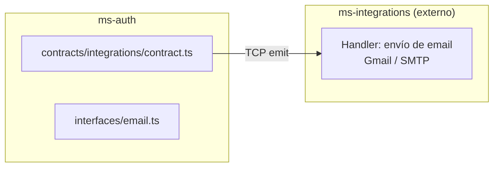

# Módulo: Integrations

> **Ruta/Namespace:** `src/contracts/integrations/`
> **Criticidad:** 🟢 Baja — integración de soporte (notificaciones)
> **Estado:** 🚧 Contrato definido — handlers sin implementar en este ms

---

## Propósito

Define el contrato de comunicación con el microservicio `ms-integrations`, que gestiona las integraciones con servicios externos. Actualmente expone un único comando para el envío de notificaciones por email. `ms-auth` puede emitir notificaciones ante eventos de autenticación relevantes (ej: creación de claves, accesos inválidos).

---

## Funcionalidades que expone

| # | Funcionalidad | CMD | Descripción breve | Detalle |
|---|---|---|---|---|
| 4.1 | Enviar notificación email | `integrations.email.notification` | Dispara un email de notificación | [[integrations-email-notification]] |

---

## Dependencias

- **Depende de:** `common/interfaces`, `cmd/CMDS`
- **Consume servicios backend:** `ms-integrations` vía TCP (emit)

---

## Diagrama de componentes

---

## Riesgos y deuda técnica

- ⚠️ El campo `history` en el payload de notificación no está definido en detalle — estructura desconocida.
- ⚠️ Es un emit (fire-and-forget) — si el email falla, el caller no se entera.
- 🟢 Bajo acoplamiento — un único comando, fácil de reemplazar.

---

## Archivos fuente relevantes

- `src/contracts/integrations/contract.ts`
- `src/contracts/integrations/interfaces/email.ts`
- `src/contracts/integrations/_index.ts`
- `src/common/cmd/interfaces/integrations.ts`
- `src/common/cmd/constant.ts` (sección `integrations`)
- `src/common/interfaces/jobs/internal/notification.ts` (IJobInternalNotification)
