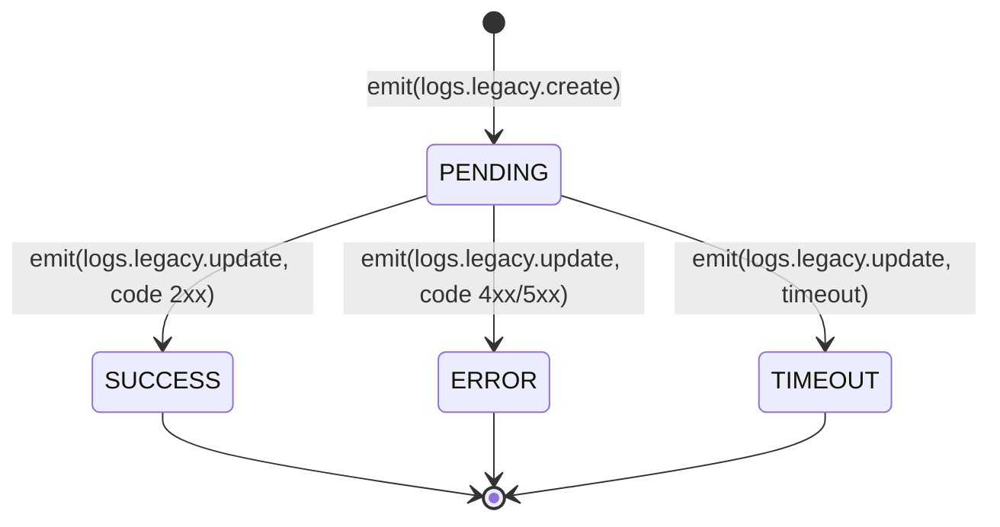

# Módulo: Logs

> **Ruta/Namespace:** `src/contracts/logs/`
> **Criticidad:** 🟡 Media — trazabilidad del sistema
> **Estado:** 🚧 Contrato definido — handlers sin implementar en este ms

---

## Propósito

Define el contrato de comunicación con el microservicio `ms-logs`, que gestiona el registro de actividad del sistema legacy. `ms-auth` actúa como **emisor** de eventos de log al procesar requests de autenticación provenientes de los sistemas legacy (LEGACY_PANEL, LEGACY_DESCARGAS).

---

## Funcionalidades que expone

| # | Funcionalidad | CMD | Descripción breve | Detalle |
|---|---|---|---|---|
| 3.1 | Crear log | `logs.legacy.create` | Registra un request entrante | [[logs-legacy-create]] |
| 3.2 | Actualizar log | `logs.legacy.update` | Agrega la respuesta al log existente | [[logs-legacy-update]] |
| 3.3 | Buscar por ID | `logs.legacy.search.id` | Recupera un log por su ID | [[logs-legacy-search-id]] |
| 3.4 | Buscar por usuario | `logs.legacy.search.user` | Lista logs de un usuario | [[logs-legacy-search-user]] |
| 3.5 | Buscar por términos | `logs.legacy.search.terms` | Búsqueda textual sobre logs | [[logs-legacy-search-terms]] |

---

## Dependencias

- **Depende de:** `common/interfaces`, `cmd/CMDS`
- **Consume servicios backend:** `ms-logs` vía TCP

---

## Tipos de datos del dominio

```typescript
TLogsLegacyAPI:    LEGACY_PANEL | LEGACY_DESCARGAS
TLogsLegacyStatus: PENDING | SUCCESS | ERROR | TIMEOUT
TMethod:           GET | POST | PUT | PATCH | DELETE
```

---

## Patrón de uso esperado (ciclo de vida de un log)



---

## Riesgos y deuda técnica

- ⚠️ `create` y `update` son `TContractEmit` (fire-and-forget) — si `ms-logs` está caído, los logs se pierden silenciosamente.
- 🟡 No hay mecanismo de reintentos ni cola de mensajes definida.
- ⚠️ El campo `hash` en `create` y `update` no tiene su propósito documentado — posiblemente es un identificador de correlación.

---

## Archivos fuente relevantes

- `src/contracts/logs/contract.ts`
- `src/contracts/logs/interfaces/legacy.ts`
- `src/contracts/logs/_index.ts`
- `src/common/cmd/interfaces/logs.ts`
- `src/common/cmd/constant.ts` (sección `logs`)
