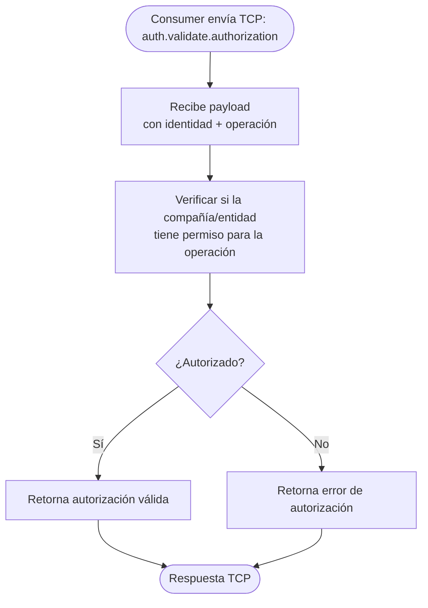

# Funcionalidad: Validar Autorización

> **Módulo:** [[modulo-auth]]
> **CMD:** `auth.validate.authorization`
> **Tipo:** Seguridad / RPC send

## Descripción funcional

Valida si una compañía o entidad autenticada tiene autorización para realizar una operación específica. Complementa `auth.validate.key` agregando una capa de control de acceso sobre la autenticación base.

## Flujo principal

> [!warning] Flujo esperado según contrato — handler no implementado. El modelo de permisos exacto es ⚠️ Pendiente de verificar en `src/contracts/auth/interfaces/validation.ts`.

## Payload de entrada

| Campo | Tipo | Obligatorio | Descripción |
|-------|------|-------------|-------------|
| ⚠️ Pendiente de verificar | — | — | Ver `src/contracts/auth/interfaces/validation.ts` |

## Riesgos

- 🔴 Sin implementación — el ecosistema puede estar operando sin control de autorización activo.
- ⚠️ El modelo de permisos (RBAC, ABAC u otro) no está explicitado en los contratos.

## Datos que lee/escribe

- **Lee:** [[entidad-company]], [[entidad-key]]

## Archivos fuente relevantes

- `src/contracts/auth/interfaces/validation.ts` (interfaz `validate-authorization`)
