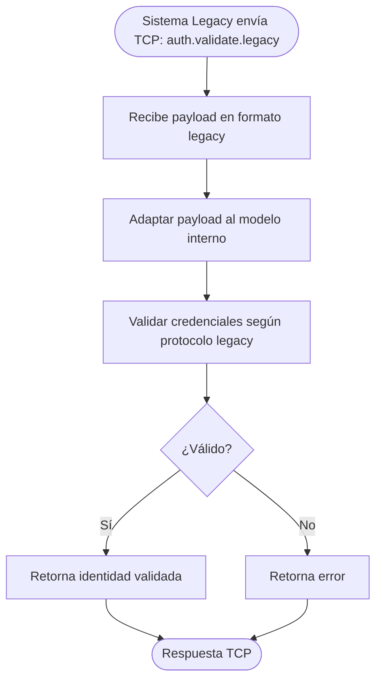

# Funcionalidad: Validar Legacy

> **Módulo:** [[modulo-auth]]
> **CMD:** `auth.validate.legacy`
> **Tipo:** Seguridad / Integración / RPC send

## Descripción funcional

Valida requests provenientes del sistema legacy (LEGACY_PANEL / LEGACY_DESCARGAS). Implementa un mecanismo de autenticación compatible con el protocolo anterior, permitiendo la coexistencia del sistema moderno con el heredado durante la transición.

## Flujo principal

> [!warning] Flujo esperado según contrato — handler no implementado. El protocolo legacy exacto es ⚠️ Pendiente de verificar — no hay documentación disponible del sistema heredado.

## Payload de entrada

| Campo | Tipo | Obligatorio | Descripción |
|-------|------|-------------|-------------|
| ⚠️ Pendiente de verificar | — | — | Ver `src/contracts/auth/interfaces/validation.ts` |

## Contexto del sistema legacy

El tipo `TLogsLegacyAPI` en `src/contracts/logs/interfaces/legacy.ts` define dos orígenes legacy:
- `LEGACY_PANEL` — panel de administración del sistema anterior
- `LEGACY_DESCARGAS` — módulo de descargas del sistema anterior

## Riesgos

- 🔴 Sin documentación del protocolo legacy — implementar correctamente requiere reverse engineering.
- 🟡 La existencia de este endpoint indica que el sistema legacy sigue activo en producción.
- ⚠️ Los mecanismos de seguridad del sistema legacy pueden ser más débiles que los del sistema moderno.

## Archivos fuente relevantes

- `src/contracts/auth/interfaces/validation.ts` (interfaz `validate-legacy`)
- `src/contracts/logs/interfaces/legacy.ts` (enum `TLogsLegacyAPI`)
