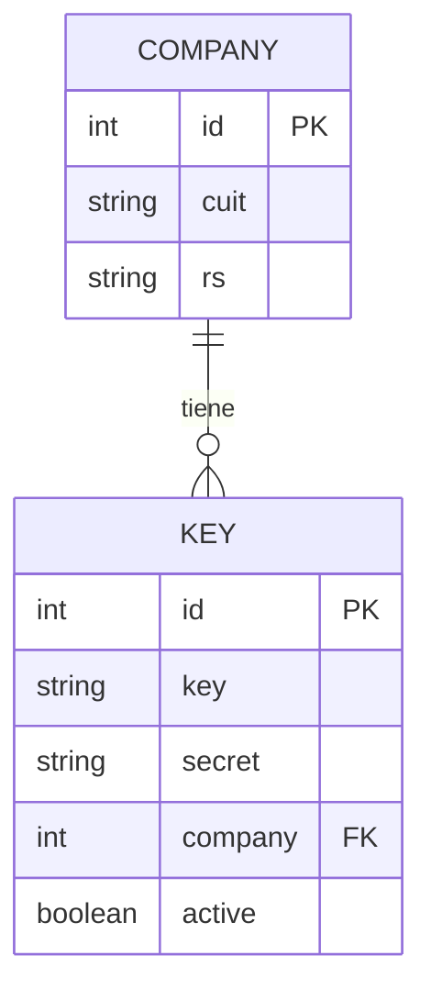
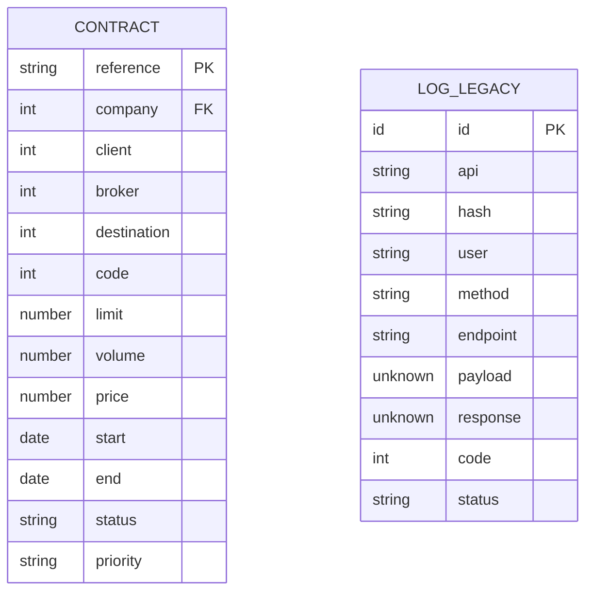
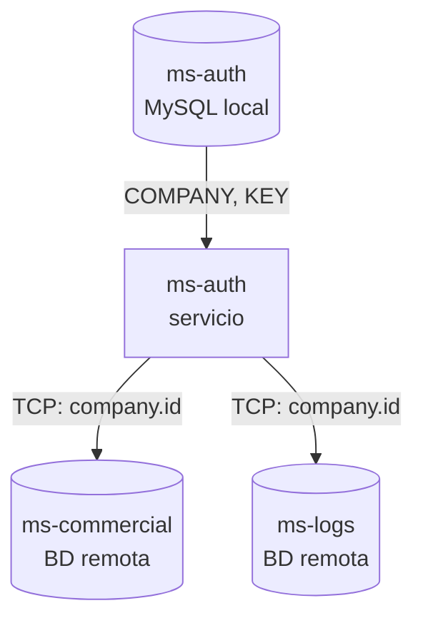

# Diagrama ER Global

> **Proyecto:** muvin-ms-auth
> **Última revisión:** 2026-04-27

---

> [!warning] Esquema Prisma no detallado
> El archivo `prisma/schema.prisma` define el esquema de BD pero no fue relevado en profundidad (modelos, campos exactos, relaciones). El diagrama a continuación se construye a partir de los **contratos TypeScript** definidos en `src/contracts/auth/schema.ts`. Verificar contra el schema Prisma real.

---

## Entidades de ms-auth (base de datos local)

---

## Entidades de microservicios externos (referencia)

Estas entidades **no viven en la BD de ms-auth** — se acceden vía TCP a otros microservicios:

---

## Relación entre dominios

---

## Notas sobre el esquema

- ⚠️ El modelo Prisma real puede tener más campos, índices y relaciones que no están reflejados aquí.
- ⚠️ `KEY.secret` debería estar hasheado en BD — sin implementación no es verificable.
- ⚠️ No se detectaron tablas de auditoría ni soft-delete en los contratos.
- ⚠️ No se detectaron migraciones versionadas en `prisma/migrations/`.
