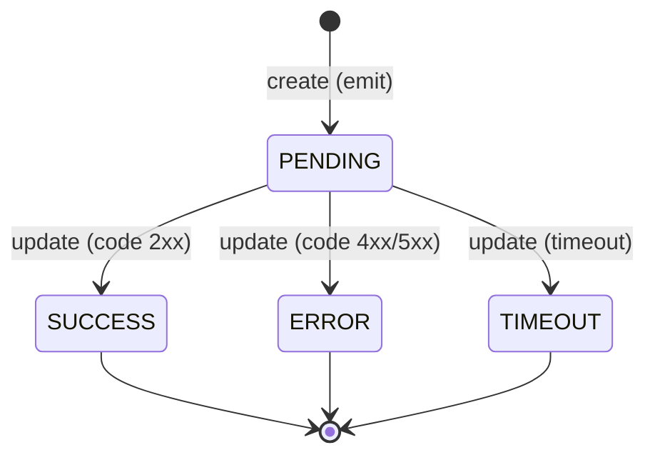

# Entidad: LogLegacy

> **BD:** ms-logs (remota — acceso vía TCP)
> **Fuente del contrato:** `src/contracts/logs/interfaces/legacy.ts`
> **Nota:** Esta entidad no vive en la BD de ms-auth. Se accede exclusivamente a través de comandos TCP hacia ms-logs.

---

## Descripción

Registro de trazabilidad de requests procesados por el sistema legacy. Cada entrada captura el request entrante (método, endpoint, payload) y luego se actualiza con la respuesta y el estado final.

---

## Campos (según contratos TypeScript)

| Campo | Tipo | Nulable | Descripción |
|-------|------|---------|-------------|
| `id` | ⚠️ pendiente | No | Identificador único (PK) |
| `api` | `TLogsLegacyAPI` | No | Origen: LEGACY_PANEL o LEGACY_DESCARGAS |
| `hash` | `string` | No | Identificador de correlación del request |
| `user` | `string` | Sí | Usuario que realizó el request |
| `method` | `TMethod` | No | Verbo HTTP: GET, POST, PUT, PATCH, DELETE |
| `endpoint` | `string` | No | Ruta del endpoint invocado |
| `payload` | `unknown` | No | Cuerpo del request |
| `response` | `unknown` | Sí | Respuesta obtenida (se completa en update) |
| `code` | `number` | Sí | Código HTTP de la respuesta |
| `status` | `TLogsLegacyStatus` | No | Estado: PENDING, SUCCESS, ERROR, TIMEOUT |

---

## Ciclo de vida

---

## Módulos que la consumen

- [[modulo-logs]] — creación, actualización y consulta de logs

---

## Archivos fuente relevantes

- `src/contracts/logs/interfaces/legacy.ts`
