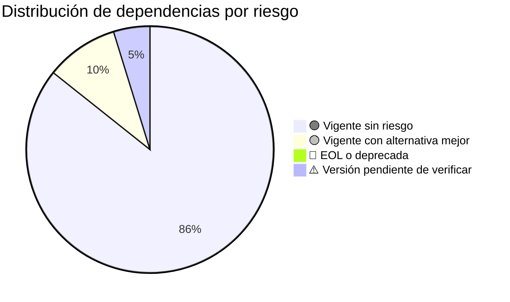

# Inventario: Dependencias Core vs. Customizaciones

> **Proyecto:** muvin-ms-auth
> **Última revisión:** 2026-04-27

---

## Dependencias de producción (`dependencies`)

### Core del framework / vendor

| Paquete | Versión | Categoría | Propósito | Estado vendor | Alternativa moderna |
|---------|---------|-----------|-----------|---------------|---------------------|
| `@nestjs/common` | 11.1.9 | Framework | Decoradores, pipes, guards, módulos NestJS | ✅ Vigente | — |
| `@nestjs/core` | 11.1.9 | Framework | Motor interno de NestJS | ✅ Vigente | — |
| `@nestjs/microservices` | 11.1.9 | Framework | Soporte TCP microservices | ✅ Vigente | — |
| `@prisma/client` | 6.19.0 | ORM | Cliente de base de datos tipado | ✅ Vigente | — |
| `reflect-metadata` | — | Peer dep | Soporte de decoradores TypeScript | ✅ Vigente | — |
| `rxjs` | — | Peer dep | Programación reactiva (usado internamente por NestJS) | ✅ Vigente | — |

### Validación y configuración

| Paquete | Versión | Categoría | Propósito | Estado vendor | Alternativa moderna |
|---------|---------|-----------|-----------|---------------|---------------------|
| `joi` | ⚠️ Pendiente de verificar | Validación | Validación de esquema para variables de entorno | ✅ Vigente | `zod` (más ergonómico con TypeScript) |

---

## Dependencias de desarrollo (`devDependencies`)

### Compilación y build

| Paquete | Versión | Propósito | Estado vendor |
|---------|---------|-----------|---------------|
| `@nestjs/cli` | — | CLI de NestJS para build y scaffolding | ✅ Vigente |
| `@nestjs/schematics` | — | Generadores de código NestJS | ✅ Vigente |
| `typescript` | 5.9.3 | Compilador TypeScript | ✅ Vigente |
| `ts-node` | — | Ejecución directa de TypeScript (dev) | ✅ Vigente |
| `ts-loader` | — | Loader TypeScript para webpack (si aplica) | ✅ Vigente |
| `tsconfig-paths` | — | Resolución de path aliases en runtime | ✅ Vigente |
| `prisma` | 6.19.0 | CLI de Prisma para migraciones y generación | ✅ Vigente |

### Linting y formateo

| Paquete | Versión | Propósito | Estado vendor |
|---------|---------|-----------|---------------|
| `eslint` | — | Linter estático (flat config, ESLint 9+) | ✅ Vigente |
| `@typescript-eslint/eslint-plugin` | — | Reglas ESLint para TypeScript | ✅ Vigente |
| `@typescript-eslint/parser` | — | Parser TypeScript para ESLint | ✅ Vigente |
| `prettier` | — | Formateador de código | ✅ Vigente |
| `eslint-config-prettier` | — | Desactiva reglas ESLint que conflictúan con Prettier | ✅ Vigente |

### Git hooks

| Paquete | Versión | Propósito | Estado vendor |
|---------|---------|-----------|---------------|
| `husky` | — | Git hooks | ✅ Vigente |
| `lint-staged` | — | Ejecuta linters solo sobre archivos staged | ✅ Vigente |

### Testing

| Paquete | Versión | Propósito | Estado vendor |
|---------|---------|-----------|---------------|
| `jest` | — | Framework de testing (configurado, sin tests) | ✅ Vigente |
| `@nestjs/testing` | — | Utilities de testing para NestJS | ✅ Vigente |
| `ts-jest` | — | Transformador Jest para TypeScript | ✅ Vigente |
| `supertest` | — | Testing de endpoints HTTP (no aplica actualmente — sin HTTP) | ✅ Vigente |

---

## Customizaciones propias del proyecto

| Archivo | Descripción | ¿Tiene alternativa estándar? |
|---------|-------------|------------------------------|
| `src/common/functions/logger.ts` | Logger con colores ANSI propio | Sí — `@nestjs/common/Logger` o `pino` / `winston` |
| `src/common/functions/api-response.ts` | Helpers de respuesta estandarizada | Sí — interceptors NestJS |
| `src/common/functions/identity.ts` | Función identidad genérica | Sí — innecesaria en la mayoría de los casos |
| `src/common/cmd/constant.ts` | Constantes de comandos RPC como strings | Sí — enums TypeScript |
| `src/config/environments.ts` | Validación Joi de variables de entorno | Sí — `@nestjs/config` con validación integrada |
| `src/contracts/types.ts` | Tipos genéricos `TContractSend` / `TContractEmit` | No — específico de la arquitectura del proyecto |

---

## Análisis de riesgo por dependencia

---

## Recomendaciones

| Dependencia actual | Situación | Recomendación | Prioridad |
|---|---|---|---|
| `joi` para env vars | Funcional pero menos ergonómico con TS | Migrar a `@nestjs/config` + `joi` o `zod` integrado | 🟢 Baja |
| Logger custom ANSI | Funcional pero no estructurado | Migrar a `pino` con `nestjs-pino` para logs JSON en producción | 🟡 Media |
| `supertest` como devDep | Sin endpoints HTTP — no tiene uso activo | Evaluar remoción o reemplazar por cliente TCP para tests | 🟢 Baja |
| Constantes string en `CMDS` | Acoplamiento frágil | Convertir a `enum` TypeScript para detección de errores en compile-time | 🟡 Media |
