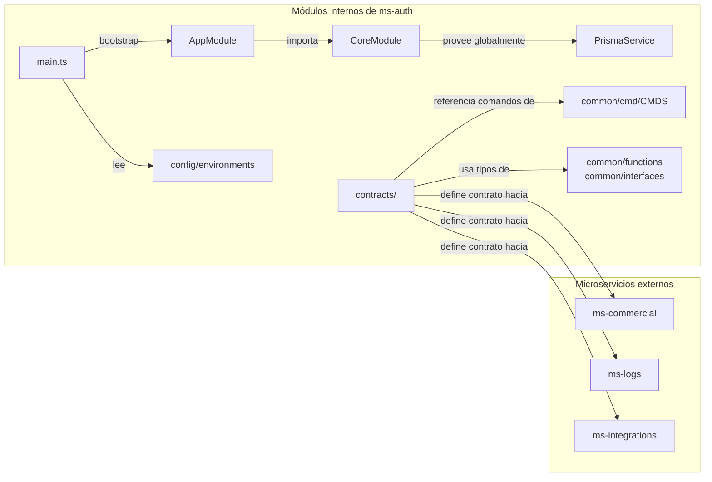

# Inventario: Dependencias entre Módulos

> **Proyecto:** muvin-ms-auth
> **Última revisión:** 2026-04-27

---

## Diagrama de dependencias

---

## Dependencias internas — detalle

| Módulo origen | Depende de | Tipo de dependencia |
|---|---|---|
| `main.ts` | `AppModule`, `config/environments`, `config/transport` | Importación directa |
| `AppModule` | `CoreModule` | Importación NestJS |
| `CoreModule` | `PrismaService` | Provider NestJS |
| `PrismaService` | `@db` (prisma/generated/client) | Importación directa (alias) |
| `contracts/auth` | `common/interfaces`, `contracts/types` | Importación directa |
| `contracts/commercial` | `common/interfaces`, `contracts/types` | Importación directa |
| `contracts/logs` | `common/interfaces`, `contracts/types` | Importación directa |
| `contracts/integrations` | `common/interfaces`, `contracts/types` | Importación directa |
| `common/cmd/constant` | `common/cmd/interfaces/*` | Importación directa (barrel) |
| `common/functions/api-response` | `common/interfaces/api-response` | Importación directa |

---

## Dependencias hacia microservicios externos

| Este módulo invoca | Microservicio destino | Mecanismo | Comandos |
|---|---|---|---|
| `contracts/commercial` | ms-commercial | TCP send/emit | `commercial.contracts.*` (7 comandos) |
| `contracts/logs` | ms-logs | TCP send/emit | `logs.legacy.*` (5 comandos) |
| `contracts/integrations` | ms-integrations | TCP emit | `integrations.email.notification` |

---

## Dependencias circulares

> [!info] Sin dependencias circulares detectadas
> El grafo de dependencias internas es un DAG (grafo acíclico dirigido). No se detectaron dependencias circulares entre módulos internos.

---

## Notas sobre acoplamiento

- **`contracts/`** es el módulo con mayor fan-out: define las interfaces de comunicación hacia 3 microservicios externos. Cualquier cambio de contrato en un microservicio externo impacta aquí.
- **`common/`** es el módulo más referenciado internamente. Es el único punto compartido entre contratos, configuración y servicios.
- **`CoreModule`** es global en NestJS — `PrismaService` está disponible en toda la aplicación sin necesidad de importar el módulo explícitamente en cada feature module.
- ⚠️ Los módulos externos (`ms-commercial`, `ms-logs`, `ms-integrations`) se acoplan a través de **constantes de string** (`CMDS`) — si se cambia el nombre de un comando en el microservicio destino sin actualizar `CMDS`, el error es silencioso en tiempo de compilación y solo aparece en runtime.
