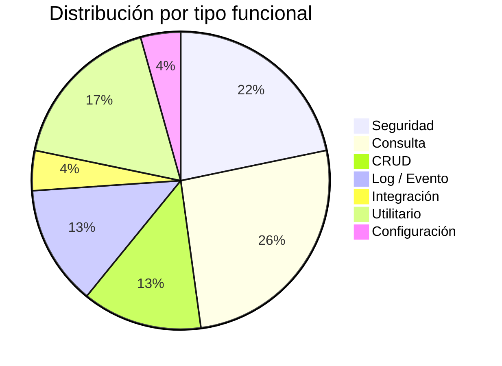
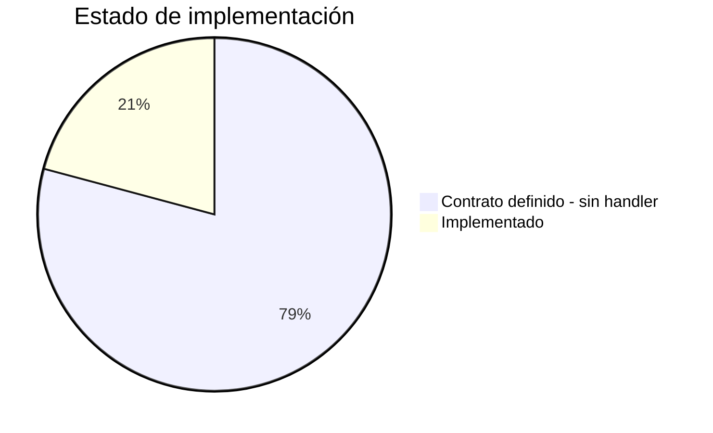
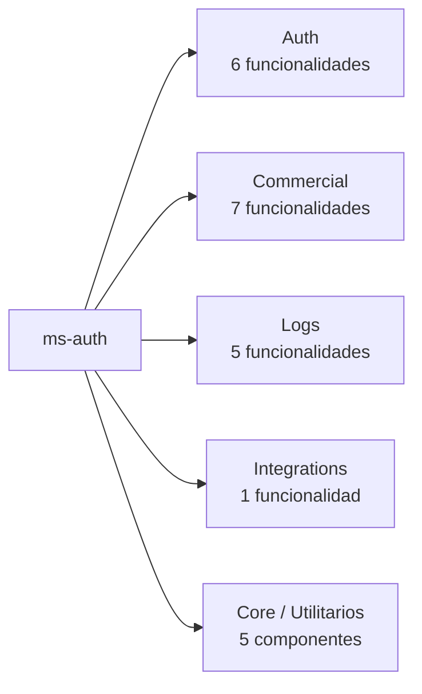

# Inventario: Clasificación Funcional de Módulos

> **Proyecto:** muvin-ms-auth
> **Última revisión:** 2026-04-27

---

## Clasificación por tipo funcional

| Módulo / Contrato | Tipo | Descripción breve | Estado implementación |
|---|---|---|---|
| `auth.companies` | Consulta | Búsqueda de compañías por ID o múltiples IDs | 🚧 Contrato definido, handler no implementado |
| `auth.validate.create-key` | Seguridad | Alta de clave API para una compañía | 🚧 Contrato definido, handler no implementado |
| `auth.validate.generate-signature` | Seguridad | Generación de firma HMAC/hash para requests | 🚧 Contrato definido, handler no implementado |
| `auth.validate.key` | Seguridad | Validación de clave API + signature + timestamp | 🚧 Contrato definido, handler no implementado |
| `auth.validate.authorization` | Seguridad | Validación de autorización general | 🚧 Contrato definido, handler no implementado |
| `auth.validate.legacy` | Seguridad / Integración | Validación compatible con sistema legacy | 🚧 Contrato definido, handler no implementado |
| `commercial.contracts.create` | CRUD | Creación de contrato comercial | 🚧 Contrato definido, handler no implementado |
| `commercial.contracts.search-one` | Consulta | Búsqueda de contrato por compañía + referencia | 🚧 Contrato definido, handler no implementado |
| `commercial.contracts.search-list` | Consulta | Búsqueda de contratos por compañía + cliente + código | 🚧 Contrato definido, handler no implementado |
| `commercial.contracts.search-reference` | Consulta | Búsqueda por referencia + compañía | 🚧 Contrato definido, handler no implementado |
| `commercial.contracts.search-all` | Consulta / Reporte | Listado paginado con filtros (cliente, estado, código) | 🚧 Contrato definido, handler no implementado |
| `commercial.contracts.change-limit` | CRUD | Modificación del límite de un contrato | 🚧 Contrato definido, handler no implementado |
| `commercial.contracts.change-balance` | CRUD | Modificación del balance de un contrato | 🚧 Contrato definido, handler no implementado |
| `logs.legacy.create` | Log / Evento | Registro de log de request entrante (sistema legacy) | 🚧 Contrato definido, handler no implementado |
| `logs.legacy.update` | Log / Evento | Actualización de log con respuesta y código HTTP | 🚧 Contrato definido, handler no implementado |
| `logs.legacy.search-id` | Consulta | Búsqueda de log por ID | 🚧 Contrato definido, handler no implementado |
| `logs.legacy.search-user` | Consulta | Búsqueda de logs por usuario | 🚧 Contrato definido, handler no implementado |
| `logs.legacy.search-terms` | Consulta | Búsqueda de logs por términos | 🚧 Contrato definido, handler no implementado |
| `integrations.email.notification` | Integración | Envío de notificación por email | 🚧 Contrato definido, handler no implementado |
| `PrismaService` | Utilitario | Proveedor global de acceso a base de datos | ✅ Implementado |
| `environments` | Configuración | Validación y exposición de variables de entorno | ✅ Implementado |
| `CMDS` | Utilitario | Constantes de comandos RPC tipados | ✅ Implementado |
| `api-response` | Utilitario | Helpers para respuestas estandarizadas de API | ✅ Implementado |
| `logger` | Utilitario | Logger con colores ANSI y contexto | ✅ Implementado |

---

## Distribución por tipo funcional

---

## Distribución por estado de implementación

> [!warning] Implementación incompleta
> El 79% de las funcionalidades tienen su contrato tipado definido pero **no tienen handler RPC implementado**. Este microservicio está en estado de scaffolding avanzado. Ver [[deuda-tecnica]].

---

## Agrupación por dominio

---

## Tipos funcionales — definición usada

| Tipo | Descripción |
|------|-------------|
| **Seguridad** | Autenticación, autorización, generación/validación de claves y firmas |
| **CRUD** | Creación, modificación de entidades persistidas |
| **Consulta** | Lectura de datos sin efecto secundario |
| **Reporte** | Consulta paginada o agregada orientada a presentación |
| **Log / Evento** | Registro de eventos del sistema (sin respuesta de negocio) |
| **Integración** | Comunicación con sistemas externos (email, terceros) |
| **Utilitario** | Funciones de soporte sin lógica de negocio propia |
| **Configuración** | Gestión de parámetros del entorno de ejecución |
