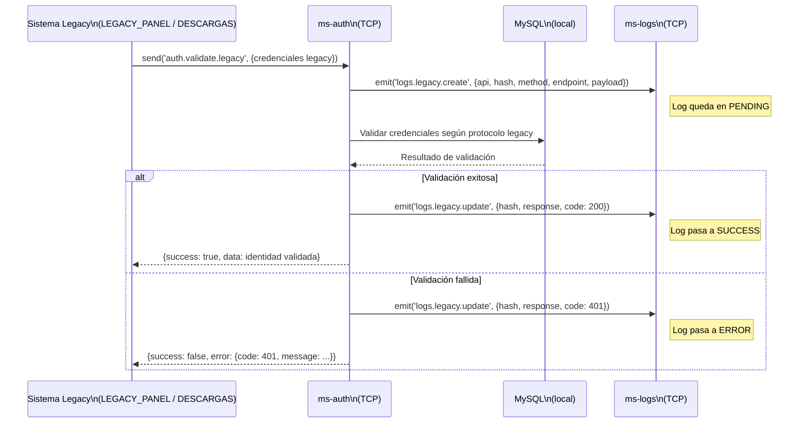

# Flujo: Autenticación de Request Legacy

> **Última revisión:** 2026-04-27
> **Módulos involucrados:** [[modulo-auth]], [[modulo-logs]]

---

## Descripción

Flujo de autenticación para requests provenientes del sistema legacy (LEGACY_PANEL o LEGACY_DESCARGAS). Utiliza un protocolo de validación diferente al moderno y genera logs de trazabilidad en ms-logs.

---

## Diagrama de secuencia

> [!warning] Flujo esperado según contratos. Handlers no implementados. El protocolo de validación legacy es ⚠️ Pendiente de verificar.

---

## Precondiciones

- El sistema legacy envía credenciales en el formato esperado por `auth.validate.legacy`.
- `ms-logs` está disponible para recibir los emits (si no lo está, los logs se pierden).

---

## Postcondiciones

- El sistema legacy recibe respuesta de autenticación.
- El evento queda registrado en ms-logs (si ms-logs está disponible).

---

## Riesgos

- 🔴 El protocolo legacy no está documentado — implementar requiere reverse engineering.
- ⚠️ Los logs se emiten como fire-and-forget — si ms-logs falla, no hay registro del acceso.
