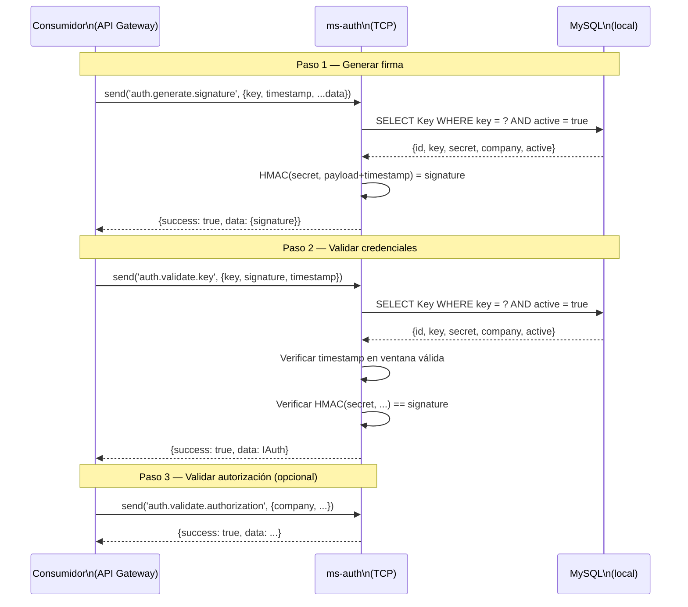

# Flujo: Autenticación de Request Moderno

> **Última revisión:** 2026-04-27
> **Módulos involucrados:** [[modulo-auth]], [[modulo-logs]]

---

## Descripción

Flujo end-to-end de autenticación de un request proveniente del sistema moderno (API Gateway u otro microservicio). El consumidor debe primero obtener una firma y luego validar sus credenciales antes de acceder a recursos protegidos.

---

## Diagrama de secuencia

> [!warning] Flujo esperado según contratos definidos. Handlers no implementados.

---

## Precondiciones

- La compañía tiene al menos una clave activa (`active: true`).
- El timestamp enviado está dentro de la ventana de validez (⚠️ ventana no definida aún).

---

## Postcondiciones

- El consumidor recibe `IAuth` con los datos de la compañía y la clave.
- El consumidor puede proceder con el request protegido.

---

## Flujos alternativos

| Condición | Resultado |
|-----------|-----------|
| Key no existe o `active: false` | Error: clave inválida |
| Timestamp fuera de ventana | Error: request expirado |
| Firma no coincide | Error: firma inválida |
| Compañía sin autorización para la operación | Error: no autorizado |
