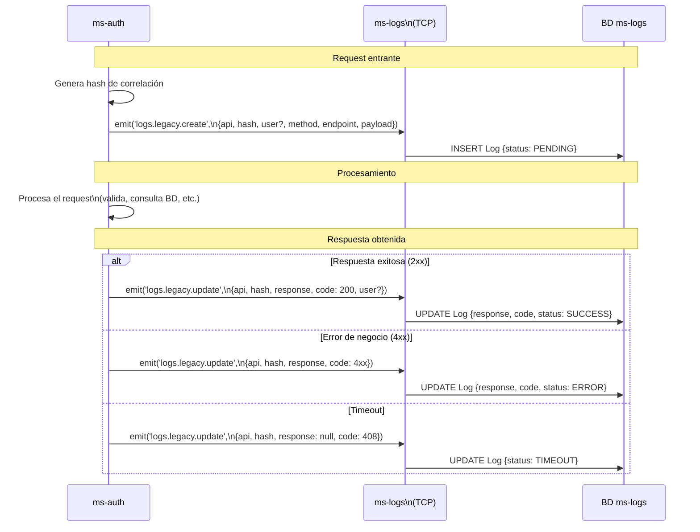

# Flujo: Ciclo de Vida de Log Legacy

> **Última revisión:** 2026-04-27
> **Módulos involucrados:** [[modulo-logs]]

---

## Descripción

Flujo completo de registro de trazabilidad para un request del sistema legacy. Usa el campo `hash` como identificador de correlación para unir el registro inicial con su actualización posterior.

---

## Diagrama de secuencia

---

## Consideraciones de implementación

- El `hash` debe generarse de forma única por request (UUID v4 o similar).
- El `emit` es fire-and-forget — si ms-logs está caído, el log se pierde sin afectar el procesamiento del request.
- No existe mecanismo de reintento ni buffer local para logs no entregados.

## Riesgos

- ⚠️ Logs perdidos si ms-logs no está disponible — trazabilidad comprometida.
- ⚠️ Sin idempotencia en `create` — si se emite dos veces el mismo hash, puede haber duplicados.
