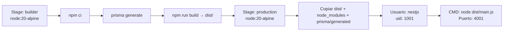

# Build y Despliegue

> **Proyecto:** muvin-ms-auth
> **Última revisión:** 2026-04-27

---

## Scripts disponibles

| Script | Comando | Descripción |
|--------|---------|-------------|
| Desarrollo | `npm run start:dev` | Modo watch — recarga en cambios |
| Debug | `npm run start:debug` | Con debugger Node.js |
| Build producción | `npm run build` | Compila a `dist/` |
| Producción | `npm run start:prod` | Ejecuta `dist/main.js` |
| Lint | `npm run lint` | ESLint sobre el código fuente |
| Format | `npm run format` | Prettier sobre el código fuente |
| Generar Prisma | `npm run prisma:generate` | Genera cliente Prisma en `prisma/generated/client/` |
| Migraciones | `npm run prisma:migrate` | Ejecuta migraciones pendientes |

---

## Proceso de build (Dockerfile)



---

## CI/CD

### Deploy a DEV (`.github/workflows/deploy-dev.yml`)

⚠️ Contenido del workflow pendiente de relevar. Deploy automático al entorno de desarrollo.

### Sync CAP (`.github/workflows/sync-cap.yml`)

⚠️ Propósito pendiente de verificar. Posiblemente sincronización de configuración o código con un sistema externo denominado "CAP".

---

## Docker Compose (local)

```bash
# Levantar MySQL + ms-auth
cd docker/
docker-compose up -d

# Solo MySQL (para desarrollo local sin contenedor de app)
docker-compose up -d db-auth
```

**Servicios definidos:**
- `db-auth` — MySQL 8.0 con healthcheck
- `ms-auth` — Microservicio (⚠️ comentado en docker-compose según el reconocimiento)

---

## Puerto por defecto

| Entorno | Puerto |
|---------|--------|
| Desarrollo local | `4001` (configurable via `PORT`) |
| Producción Docker | `4001` (expuesto en Dockerfile) |
