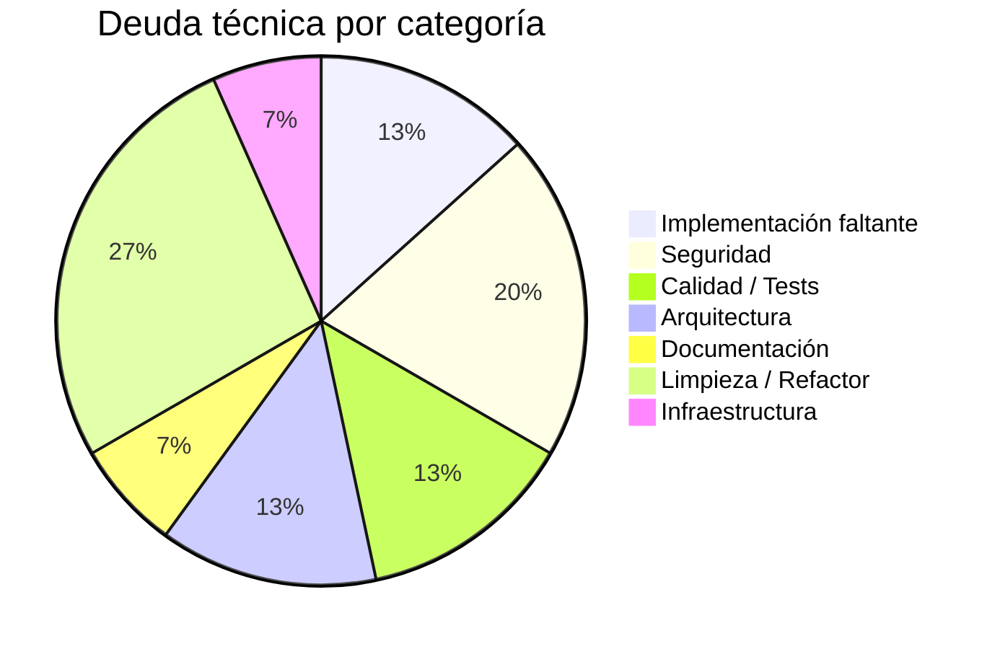
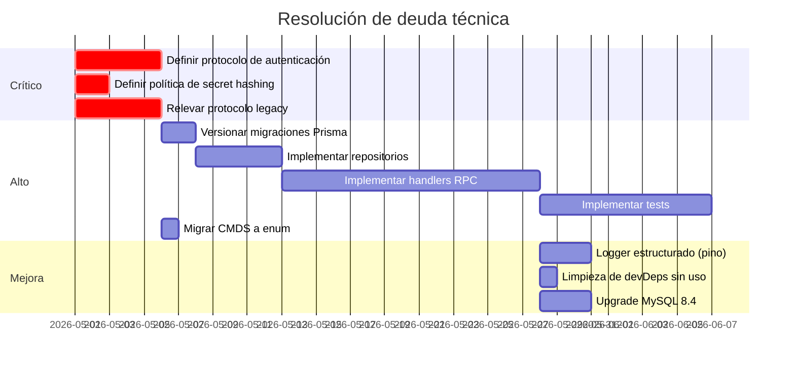

# Deuda Técnica

> **Proyecto:** muvin-ms-auth
> **Última revisión:** 2026-04-27

---

## Lista priorizada

### 🔴 Crítica — Bloquea producción segura

| ID | Deuda | Impacto | Esfuerzo | Archivo/Área |
|----|-------|---------|---------|--------------|
| DT-01 | Handlers RPC no implementados — el microservicio no procesa ningún mensaje | 🔴 Total | Alto | `src/core/repositories/`, todos los módulos |
| DT-02 | Protocolo de autenticación (firma, algoritmo, ventana de timestamp) sin definir ni documentar | 🔴 Seguridad | Medio | `contracts/auth/interfaces/validation.ts` |
| DT-03 | Política de almacenamiento de `secret` no definida (hash vs texto plano) | 🔴 Seguridad | Bajo | `contracts/auth/schema.ts` |
| DT-04 | Protocolo legacy sin documentación — implementar es reverse engineering | 🔴 Productividad | Alto | `contracts/auth/interfaces/validation.ts` |

---

### 🟡 Alta — Debe resolverse antes o durante implementación

| ID | Deuda | Impacto | Esfuerzo | Archivo/Área |
|----|-------|---------|---------|--------------|
| DT-05 | Sin migraciones Prisma versionadas — el esquema no tiene historial | 🟡 Operativo | Bajo | `prisma/` |
| DT-06 | Sin tests (0% coverage) — el primer bug es invisible | 🟡 Calidad | Alto (continuo) | Todo el proyecto |
| DT-07 | Comandos RPC como strings — acoplamiento frágil, errores silenciosos | 🟡 Mantenibilidad | Bajo | `src/common/cmd/constant.ts` |
| DT-08 | `src/core/repositories/_index.ts` vacío — capa de repositorio sin implementar | 🟡 Arquitectura | Alto | `src/core/repositories/` |
| DT-09 | Schema Prisma no relevado — modelo de datos real desconocido | 🟡 Documentación | Bajo | `prisma/schema.prisma` |

---

### 🟢 Media — Mejora de calidad planificable

| ID | Deuda | Impacto | Esfuerzo | Archivo/Área |
|----|-------|---------|---------|--------------|
| DT-10 | Logger custom ANSI en lugar de logger estructurado (JSON) | 🟢 Operabilidad | Bajo | `src/common/functions/logger.ts` |
| DT-11 | Validación de entorno con Joi directa en lugar de `@nestjs/config` | 🟢 Mantenibilidad | Bajo | `src/config/environments.ts` |
| DT-12 | `supertest` como devDependency sin uso (no hay endpoints HTTP) | 🟢 Limpieza | Mínimo | `package.json` |
| DT-13 | Función identidad `IDENTITY` sin uso aparente | 🟢 Limpieza | Mínimo | `src/common/functions/identity.ts` |
| DT-14 | Tipos `unknown` en payloads de logs e integrations — sin tipado del contenido | 🟢 Mantenibilidad | Medio | `contracts/logs/`, `contracts/integrations/` |
| DT-15 | MySQL 8.0 con soporte hasta abril 2026 — planificar upgrade | 🟢 Infraestructura | Medio | `docker/docker-compose.yml` |

---

## Distribución de deuda por categoría

---

## Roadmap sugerido de resolución

