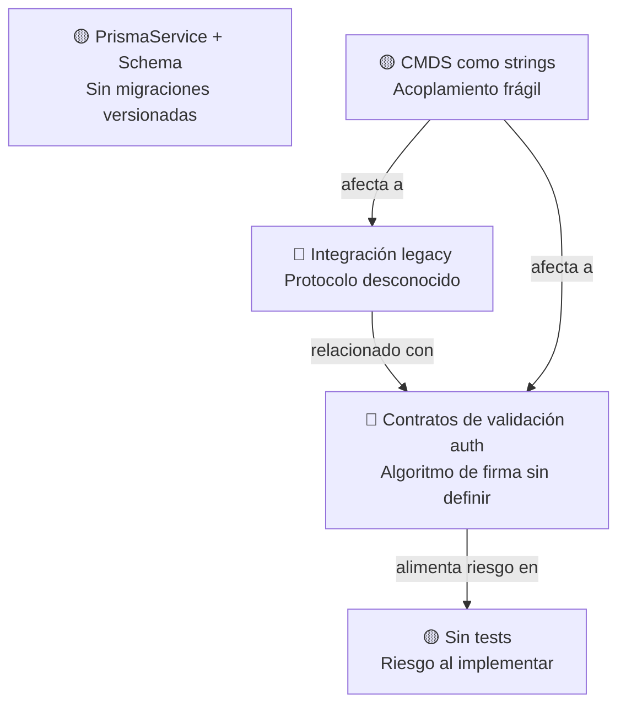

# Hotspots: Zonas de Mayor Riesgo

> **Proyecto:** muvin-ms-auth
> **Última revisión:** 2026-04-27

---

## Definición

Un hotspot es un área del código con alta concentración de riesgo técnico, complejidad potencial, o que históricamente concentra bugs en proyectos similares.

---

## Hotspot 1 — Contratos de validación auth

**Archivos:** `src/contracts/auth/interfaces/validation.ts`, `src/common/cmd/interfaces/auth.ts`

**Riesgo:** 🔴 Alto

| Factor | Detalle |
|--------|---------|
| Criticidad funcional | Es el núcleo de autenticación de todo el ecosistema |
| Decisiones no documentadas | Algoritmo de firma, ventana de timestamp, protocolo legacy |
| Sin tests | Ninguna cobertura de pruebas |
| Sin implementación | Los handlers RPC no existen — cualquier bug introducido al implementar es invisible hasta runtime |

**Acción recomendada:** Documentar decisiones de diseño de seguridad antes de implementar. Escribir tests de contrato antes que los handlers.

---

## Hotspot 2 — PrismaService + schema.prisma

**Archivos:** `src/core/services/prisma.ts`, `prisma/schema.prisma`

**Riesgo:** 🟡 Medio

| Factor | Detalle |
|--------|---------|
| Sin migraciones versionadas | Cambios al esquema sin historial auditables |
| Modelo no relevado en detalle | Campos, índices y relaciones desconocidos más allá de los contratos |
| Provider global | Un error en PrismaService afecta toda la aplicación |
| Sin tests de integración con BD | No hay tests que verifiquen queries contra schema real |

**Acción recomendada:** Generar migraciones desde el schema actual y versionarlas. Relevar el schema completo.

---

## Hotspot 3 — Acoplamiento por constantes string (CMDS)

**Archivo:** `src/common/cmd/constant.ts`

**Riesgo:** 🟡 Medio

| Factor | Detalle |
|--------|---------|
| Strings como interfaz de contrato | Un typo en el nombre del comando es un error silencioso en compile-time |
| Fan-out alto | 4 módulos de contratos dependen de estas constantes |
| Sin validación en runtime | NestJS no valida que el microservicio destino tenga un handler registrado |

**Acción recomendada:** Migrar de strings a `enum` TypeScript. Añadir tests de smoke que validen conectividad entre microservicios.

---

## Hotspot 4 — Integración legacy

**Archivos:** `src/contracts/auth/interfaces/validation.ts` (`validate-legacy`), `src/contracts/logs/interfaces/legacy.ts`

**Riesgo:** 🔴 Alto

| Factor | Detalle |
|--------|---------|
| Sin documentación del protocolo | El sistema legacy no está documentado en este repositorio |
| Dos orígenes distintos (PANEL + DESCARGAS) | Pueden tener protocolos diferentes |
| Trazabilidad frágil | Logs fire-and-forget — si ms-logs falla, no hay registro |

**Acción recomendada:** Relevar el protocolo legacy antes de implementar. Documentar en `glosario.md`.

---

## Hotspot 5 — Ausencia total de tests

**Alcance:** Todo el proyecto

**Riesgo:** 🟡 Medio (se vuelve 🔴 en cuanto se implemente lógica)

| Factor | Detalle |
|--------|---------|
| 0% de cobertura actual | No existe ningún archivo `.spec.ts` |
| Sin CI que ejecute tests | No se detectó step de testing en los workflows |
| Microservicio de seguridad crítica | El primer bug en producción puede ser un bypass de autenticación |

**Acción recomendada:** Implementar TDD estricto desde el primer handler. Agregar `jest` al pipeline de CI.

---

## Mapa de hotspots

