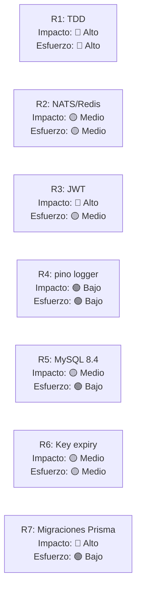

# Recomendaciones de Modernización

> **Proyecto:** muvin-ms-auth
> **Última revisión:** 2026-04-27
> **Nota:** Este documento es una propuesta técnica fundamentada. No implica compromiso de implementación.

---

## Estado actual

`ms-auth` es un microservicio con arquitectura moderna (NestJS 11, TypeScript strict, Prisma 6) pero en estado de scaffolding: los contratos están definidos, el skeleton está correcto, pero la lógica de negocio no existe. Es una base sólida para construir.

---

## Recomendación 1 — Completar la implementación con TDD

**Prioridad:** 🔴 Inmediata

Antes de agregar cualquier feature, implementar los handlers con enfoque test-driven:

1. Escribir tests unitarios para cada handler RPC.
2. Escribir tests de integración contra MySQL real (no mocks de BD).
3. Agregar los tests al pipeline CI/CD.

**Por qué:** Un microservicio de autenticación sin tests es una bomba de tiempo. El primer bug puede ser un bypass de seguridad.

---

## Recomendación 2 — Migrar transporte TCP a NATS o Redis Pub/Sub

**Prioridad:** 🟡 Mediano plazo

El transporte TCP actual requiere conocer la IP y puerto de cada microservicio. NATS o Redis Streams proveen:

- Service discovery automático
- Reintentos automáticos
- Fanout de eventos
- Dead letter queue para mensajes fallidos (resuelve DT fire-and-forget de logs)

**Costo:** Requiere cambiar el módulo de transporte en todos los microservicios del ecosistema. NestJS soporta NATS nativamente con `@nestjs/microservices`.

---

## Recomendación 3 — Implementar JWT para el protocolo de autenticación moderno

**Prioridad:** 🔴 Crítica (antes de implementar handlers)

En lugar de un esquema HMAC + timestamp custom, considerar:

- **JWT firmado con RS256** (clave privada en ms-auth, clave pública distribuida a consumidores)
- **JWKS endpoint** para rotación automática de claves
- Librerías maduras: `@nestjs/jwt`, `jose`

**Ventajas:** Estándar de industria, librerías probadas, fácil integración con API Gateways.

**Consideración:** Si el sistema legacy no puede consumir JWT, mantener `validate.legacy` con protocolo propio, pero aislar ese flujo claramente.

---

## Recomendación 4 — Logger estructurado con pino

**Prioridad:** 🟢 Baja

Reemplazar el logger ANSI custom por `nestjs-pino`:

```typescript
// En lugar del logger custom
import { Logger } from 'nestjs-pino';
```

**Ventajas:** Logs en JSON, integrable con Datadog/CloudWatch/Loki, nivel de log configurable por entorno.

---

## Recomendación 5 — Upgrade MySQL 8.0 → 8.4 LTS

**Prioridad:** 🟡 Antes de abril 2026

MySQL 8.0 pierde soporte en abril 2026. MySQL 8.4 es la versión LTS actual.

**Costo:** Bajo — cambio de imagen Docker en `docker-compose.yml` + verificación de compatibilidad con Prisma.

---

## Recomendación 6 — Agregar expiración y rotación de claves API

**Prioridad:** 🟡 Mediano plazo

Agregar al modelo `IKey`:
- `expires_at: Date | null` — TTL opcional
- `last_used_at: Date` — para detectar claves inactivas
- `rotated_at: Date | null` — historial de rotación

Agregar comando: `auth.rotate.key` — genera nuevo par y desactiva el anterior.

---

## Recomendación 7 — Versionar migraciones Prisma desde hoy

**Prioridad:** 🔴 Inmediata

Ejecutar `prisma migrate dev --name init` para generar la primera migración desde el schema actual. Esto es necesario **antes** del primer despliegue productivo con datos reales.

---

## Resumen de impacto/esfuerzo


