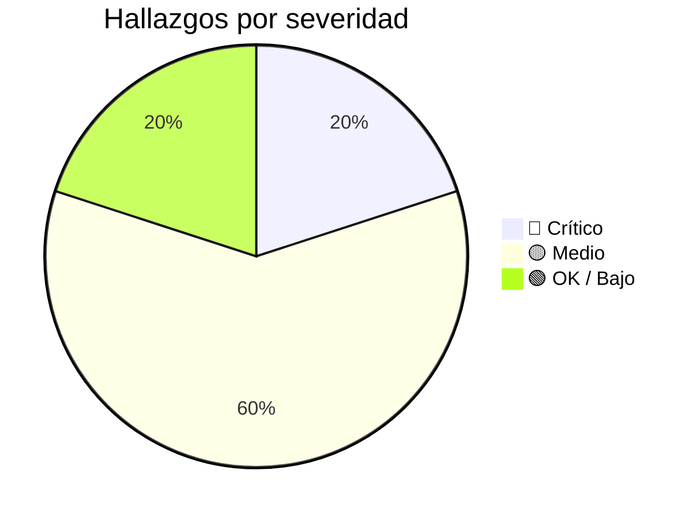

# Inventario de Seguridad

> **Proyecto:** muvin-ms-auth
> **Última revisión:** 2026-04-27
> **Auditor:** Análisis estático de contratos y configuración

---

> [!danger] Microservicio sin implementación
> La mayoría de los riesgos de seguridad no pueden confirmarse ni descartarse porque los handlers RPC **no están implementados**. Este inventario documenta los riesgos potenciales detectados en contratos, configuración e infraestructura.

---

## Hallazgos por área

### 1. Gestión de credenciales y secretos

| ID | Hallazgo | Severidad | Archivo | Estado |
|----|---------|-----------|---------|--------|
| S-01 | `IKey.secret` no especifica si debe almacenarse hasheado — riesgo de texto plano en BD | 🔴 Crítico | `contracts/auth/schema.ts` | ⚠️ Sin verificar |
| S-02 | No hay mecanismo de expiración de claves API (sin campo `expires_at` en `IKey`) | 🟡 Medio | `contracts/auth/schema.ts` | Confirmado |
| S-03 | No hay rotación automática de secretos definida en contratos | 🟡 Medio | `contracts/auth/` | Confirmado |
| S-04 | `.env-template` seguro — sin valores reales commitados | 🟢 OK | `.env-template` | Confirmado |

### 2. Autenticación y autorización

| ID | Hallazgo | Severidad | Archivo | Estado |
|----|---------|-----------|---------|--------|
| S-05 | Sin ventana de validez de timestamp definida en contrato — vulnerable a replay attacks | 🔴 Crítico | `contracts/auth/interfaces/validation.ts` | Confirmado |
| S-06 | El algoritmo de firma (HMAC, JWT, etc.) no está especificado — riesgo de implementación débil | 🔴 Crítico | `contracts/auth/interfaces/validation.ts` | Sin verificar |
| S-07 | Sin rate limiting definido a nivel de contrato para `validate.key` | 🟡 Medio | `contracts/auth/interfaces/validation.ts` | Confirmado |
| S-08 | `validate.legacy` soporta protocolo heredado sin documentación — riesgo de compatibilidad con mecanismos débiles | 🔴 Crítico | `contracts/auth/interfaces/validation.ts` | Sin verificar |
| S-09 | El modelo de permisos de `validate.authorization` no está definido (RBAC, ABAC u otro) | 🟡 Medio | `contracts/auth/interfaces/validation.ts` | Sin verificar |

### 3. Transporte y red

| ID | Hallazgo | Severidad | Archivo | Estado |
|----|---------|-----------|---------|--------|
| S-10 | Comunicación TCP sin TLS entre microservicios — tráfico en texto plano en red interna | 🟡 Medio | `config/transport.ts` | Confirmado |
| S-11 | Sin service discovery — IPs/puertos de microservicios externos hardcodeadas en config | 🟡 Medio | `config/environments.ts` | Sin verificar |
| S-12 | El microservicio escucha en HOST configurable — si se configura `0.0.0.0` en producción sin firewall, queda expuesto | 🟡 Medio | `config/environments.ts`, `main.ts` | Sin verificar |

### 4. Logs y trazabilidad

| ID | Hallazgo | Severidad | Archivo | Estado |
|----|---------|-----------|---------|--------|
| S-13 | Los emits a ms-logs son fire-and-forget — si ms-logs falla, los accesos no quedan registrados | 🟡 Medio | `contracts/logs/interfaces/legacy.ts` | Confirmado |
| S-14 | El campo `payload` en logs legacy es `unknown` — puede contener datos sensibles sin sanitizar | 🟡 Medio | `contracts/logs/interfaces/legacy.ts` | Sin verificar |
| S-15 | Sin logs de auditoría para operaciones de gestión de claves (`create-key`) | 🟡 Medio | `contracts/auth/interfaces/validation.ts` | Sin verificar |

### 5. Base de datos

| ID | Hallazgo | Severidad | Archivo | Estado |
|----|---------|-----------|---------|--------|
| S-16 | Sin migraciones versionadas — el esquema de BD no tiene historial de cambios auditables | 🟡 Medio | `prisma/` | Confirmado |
| S-17 | `DATABASE_URL` incluye credenciales en la connection string — verificar que no esté logueado | 🟢 Bajo | `.env-template` | Sin verificar |

### 6. Infraestructura y contenedor

| ID | Hallazgo | Severidad | Archivo | Estado |
|----|---------|-----------|---------|--------|
| S-18 | Dockerfile usa usuario no-root `nestjs` (uid 1001) — buena práctica | 🟢 OK | `docker/Dockerfile` | Confirmado |
| S-19 | Sin escaneo de vulnerabilidades de imagen Docker en CI/CD detectado | 🟡 Medio | `.github/workflows/` | Sin verificar |

### 7. Dependencias

| ID | Hallazgo | Severidad | Archivo | Estado |
|----|---------|-----------|---------|--------|
| S-20 | Sin `npm audit` en pipeline CI detectado | 🟡 Medio | `.github/workflows/` | Sin verificar |

---

## Resumen por severidad

---

## Acciones prioritarias recomendadas

1. **S-01, S-05, S-06, S-08** — Definir y documentar: algoritmo de firma, ventana de timestamp, política de hashing de secrets, y protocolo legacy antes de implementar los handlers.
2. **S-07** — Implementar rate limiting en el gateway que consume ms-auth.
3. **S-13** — Evaluar mecanismo de reintentos o buffer local para logs críticos de seguridad.
4. **S-16** — Generar y versionar migraciones Prisma antes del primer despliegue productivo.
