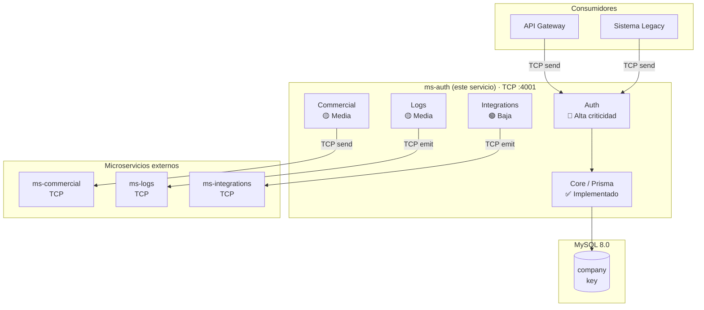
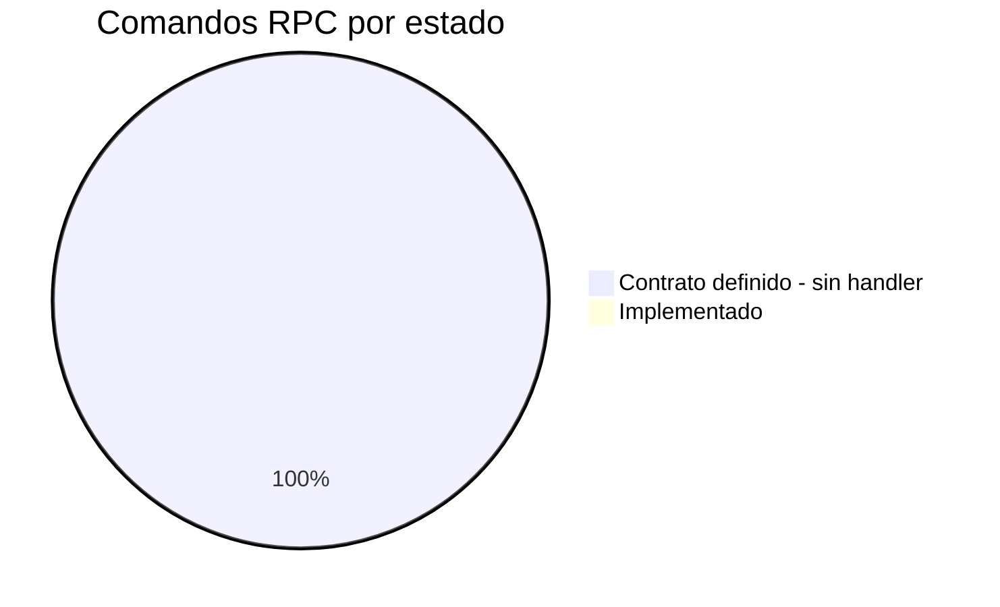

# muvin-ms-auth — Documentación Técnica

> **Stack:** NestJS 11 · TypeScript 5.9 · Prisma 6 · MySQL 8.0 · TCP Microservices
> **Versión del proyecto:** 0.0.1
> **Última revisión de documentación:** 2026-04-27
> **Estado:** 🚧 Scaffolding avanzado — handlers sin implementar

---

> [!info] Propósito del proyecto
> `ms-auth` es el microservicio de autenticación y autorización del ecosistema Muvin (BCR). Gestiona claves API de compañías, valida la identidad de consumidores del ecosistema (modernos y legacy), y define los contratos tipados de comunicación con otros tres microservicios: `ms-commercial`, `ms-logs` y `ms-integrations`.

---

## Arquitectura de alto nivel

---

## Módulos principales

| # | Módulo | Descripción breve | Criticidad | Estado | Enlace |
|---|--------|-------------------|------------|--------|--------|
| 1 | Auth | Autenticación y autorización del ecosistema — 7 comandos | 🔴 Alta | 🚧 Sin handlers | [[modulo-auth]] |
| 2 | Commercial | Contratos comerciales vía ms-commercial — 7 comandos | 🟡 Media | 🚧 Sin handlers | [[modulo-commercial]] |
| 3 | Logs | Trazabilidad legacy vía ms-logs — 5 comandos | 🟡 Media | 🚧 Sin handlers | [[modulo-logs]] |
| 4 | Integrations | Notificaciones email vía ms-integrations — 1 comando | 🟢 Baja | 🚧 Sin handlers | [[modulo-integrations]] |
| 5 | Core | PrismaService — acceso a BD MySQL | 🟡 Media | ✅ Implementado | [[modulo-core]] |

---

## Accesos rápidos

### Overview
- [[vision-general]] — Qué hace, a quién sirve, estado actual
- [[arquitectura-alto-nivel]] — Diagrama de capas y decisiones
- [[stack-tecnologico]] — Versiones, EOL, riesgo por dependencia
- [[glosario]] — Términos de negocio y técnicos

### Módulos y funcionalidades
- [[_indice-modulos]] — Todos los módulos
- [[_indice-funcionalidades]] — Los 20 comandos RPC documentados

### Servicios backend
- [[_indice-servicios]] — Comandos TCP expuestos y consumidos
- [[auth-endpoints]] — Comandos que expone ms-auth
- [[commercial-endpoints]] — Comandos hacia ms-commercial
- [[logs-endpoints]] — Comandos hacia ms-logs
- [[integrations-endpoints]] — Comandos hacia ms-integrations

### Modelo de datos
- [[diagrama-er-global]] — Entidades y relaciones
- [[_indice-entidades]] — Company, Key, Contract, LogLegacy

### Flujos transversales
- [[_indice-flujos]] — Flujos end-to-end
- [[flujo-autenticacion-moderna]] — Request moderno completo
- [[flujo-autenticacion-legacy]] — Request legacy con logs
- [[flujo-alta-clave-api]] — Creación de credenciales
- [[flujo-ciclo-log-legacy]] — Ciclo create → update de log

### Inventarios
- [[tree-estructura-archivos]] — Árbol completo del repositorio
- [[functional-classification]] — Clasificación por tipo funcional
- [[cross-module-dependencies]] — Grafo de dependencias
- [[depends-matrix]] — Matriz NxN de dependencias
- [[core-vs-custom-dependencies]] — Dependencias vendor vs. propias
- [[reports-and-wizards-inventory]] — Consultas agregadas y reportes
- [[data-files-index]] — Archivos de configuración y datos

### Operación
- [[requisitos-entorno]] — Variables de entorno y dependencias
- [[build-y-despliegue]] — Scripts, Docker, CI/CD
- [[configuracion]] — Path aliases, TypeScript, Prisma

### Riesgos
- [[security-inventory]] — 20 hallazgos de seguridad clasificados
- [[hotspots]] — Zonas de mayor riesgo técnico
- [[deuda-tecnica]] — Lista priorizada con roadmap
- [[recomendaciones-modernizacion]] — Propuesta de mejoras

---

## Estado de implementación

> [!danger] Atención antes de desplegar
> El microservicio **no procesa ningún mensaje TCP actualmente**. Todos los handlers están pendientes de implementación. Ver [[deuda-tecnica]] para el roadmap.

---

## Convenciones de esta documentación

### Leyenda de íconos

| Ícono | Significado |
|-------|-------------|
| 🟢 | Sano / Bajo riesgo |
| 🟡 | Atención / Riesgo medio |
| 🔴 | Crítico / Alto riesgo |
| ⚠️ | Advertencia puntual |
| 🚧 | En construcción / sin implementar |
| 💀 | Código muerto / sin uso |
| 🔒 | Afecta seguridad |
| 📦 | Dependencia externa |
| 🔄 | Proceso automático / batch |
| 🔌 | Integración con sistema externo |

### Navegación

- Los enlaces `[[nombre]]` son enlaces nativos de Obsidian — clickeables en el grafo de conocimiento.
- Los diagramas están en Mermaid — se renderizan en Obsidian con el plugin nativo.
- Cada afirmación técnica referencia el archivo fuente de origen.
- Las afirmaciones sin respaldo en código están marcadas con `⚠️ Pendiente de verificar`.

### Cómo contribuir a esta documentación

1. Al implementar un handler, actualizar el archivo de funcionalidad correspondiente con el flujo real.
2. Al modificar un contrato, actualizar el archivo de módulo y el de endpoints.
3. Al cambiar el schema Prisma, actualizar `diagrama-er-global.md` y los archivos de entidades.
4. Al resolver una deuda técnica, marcarla como resuelta en `deuda-tecnica.md`.
