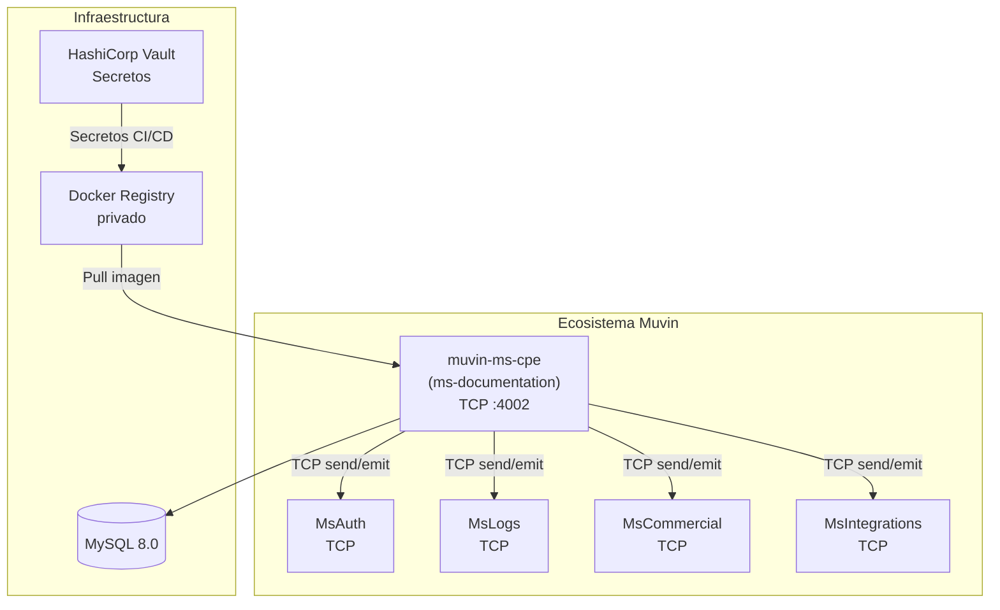
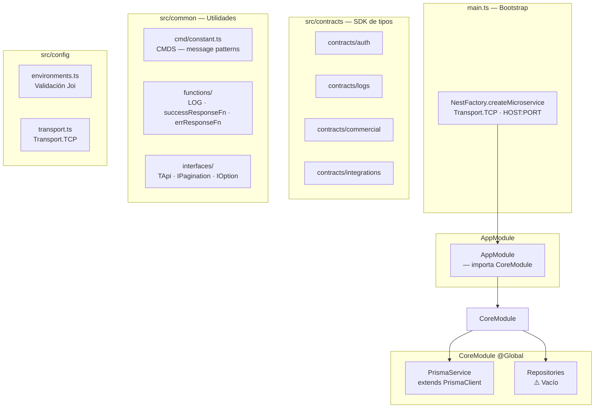
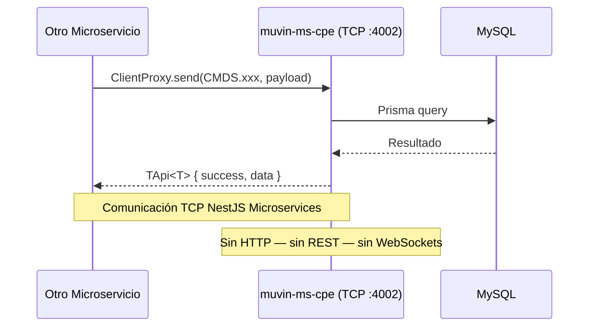

# Arquitectura de alto nivel

> **Proyecto:** `muvin-ms-cpe` — microservicio TCP dentro del ecosistema **Muvin / BCR**

## Diagrama general del ecosistema

## Diagrama de capas internas

## Descripción de capas

| Capa | Componentes | Responsabilidad |
|------|------------|-----------------|
| **Bootstrap** | `main.ts` | Arranca el microservicio TCP. Punto de entrada único. |
| **Módulo raíz** | `AppModule` | Ensambla los módulos. Punto de extensión para futuros módulos de dominio. |
| **Core global** | `CoreModule`, `PrismaService` | Provee acceso a la base de datos globalmente. |
| **Contratos** | `src/contracts/` | Define los tipos de mensajes que este microservicio puede enviar/recibir hacia/desde otros microservicios del ecosistema. |
| **Utilidades** | `src/common/` | Helpers reutilizables: logging, respuestas estandarizadas, message patterns. |
| **Configuración** | `src/config/` | Validación de entorno y definición del protocolo de transporte. |

## Patrón de comunicación

> [!info] Estado actual
> El microservicio tiene la infraestructura lista (TCP, Prisma, CoreModule global) pero **no tiene handlers de mensajes implementados todavía**. Al arrancar, escucha en `HOST:PORT` pero no responde a ningún `@MessagePattern`.
