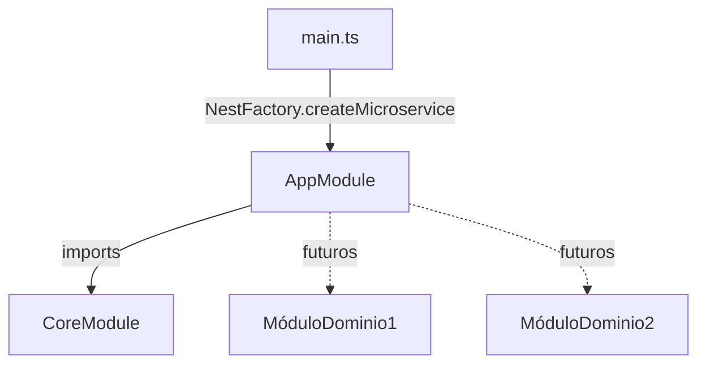

# Módulo: AppModule

> **Ruta/Namespace:** `src/module.ts`
> **Criticidad:** 🟡 Media
> **Estado:** Activo

## Propósito

Módulo raíz de la aplicación NestJS. Actúa como punto de ensamblado: importa el `CoreModule` y, en el futuro, todos los módulos de dominio. No contiene lógica de negocio.

## Funcionalidades que expone

Ninguna directamente. Es el contenedor top-level.

## Dependencias

- **Depende de:** [[modulo-core]]
- **Es usado por:** `main.ts` (punto de bootstrap)

## Diagrama

## Archivos fuente relevantes

- `src/module.ts`

## Notas

> [!info] Punto de extensión
> Para agregar un nuevo módulo de dominio, importarlo en el array `imports` de este módulo.
