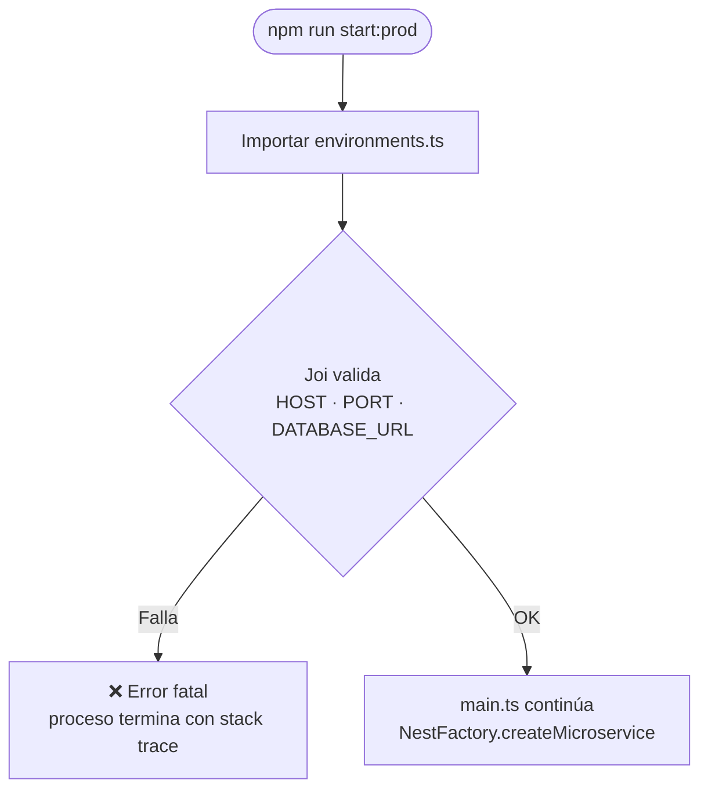

# Módulo: config (Configuración de entorno)

> **Ruta/Namespace:** `src/config/`
> **Criticidad:** 🔴 Alta
> **Estado:** Activo

## Propósito

Validación y tipado de las variables de entorno al arranque, y definición del protocolo de transporte. Si alguna variable requerida falta o tiene tipo incorrecto, la aplicación **no arranca** (patrón fail-fast).

## Componentes

### `environments.ts`

Valida con **Joi** al importarse. Variables requeridas:

| Variable | Tipo Joi | Descripción |
|----------|----------|-------------|
| `HOST` | `string` obligatorio | Host donde escucha el microservicio |
| `PORT` | `number` obligatorio | Puerto TCP |
| `DATABASE_URL` | `string` obligatorio | Cadena de conexión MySQL |

Exporta la interfaz `IEnvironment` con las tres variables tipadas.

### `transport.ts`

Exporta la constante `transport = Transport.TCP` (valor numérico `0`). Centraliza la elección del protocolo de transporte para que `main.ts` no use magic numbers.

## Diagrama de arranque con validación

## Archivos fuente relevantes

- `src/config/environments.ts`
- `src/config/transport.ts`

## Riesgos

- 🟢 Sin riesgos identificados. Patrón correcto de validación fail-fast.
