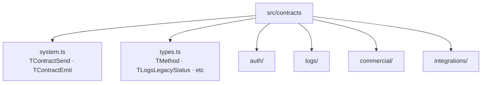

# Módulo: contracts (SDK de tipos)

> **Ruta/Namespace:** `src/contracts/`
> **Criticidad:** 🔴 Alta
> **Estado:** Activo

## Propósito

Directorio de tipos TypeScript que define el "lenguaje" de comunicación entre los microservicios del ecosistema Muvin. No contiene lógica ejecutable: solo tipos, interfaces y esquemas. Funciona como un SDK de contratos compartible.

## Estructura

## Contratos por microservicio

### MsAuth — Autenticación

| Operación | Tipo | Entrada | Salida |
|-----------|------|---------|--------|
| `companies['search-one']` | Send | `string` (id empresa) | `SchemeAuthCompany` |
| `companies['search-all']` | Send | `string[]` (ids) | `Record<string, SchemeAuthCompany>` |
| `validation['create-key']` | Send | `number` (userId) | `{ key, secret }` |
| `validation['generate-signature']` | Send | `string` | `{ signature, timestamp }` |
| `validation['validate-key']` | Send | `{ key, signature, timestamp }` | `number` (userId) |
| `validation['validate-authorization']` | Send | `string \| string[]` (scopes) | `boolean` |
| `validation['validate-legacy']` | Send | `string \| string[]` | `boolean` |

### MsLogs — Registros de auditoría

| Operación | Tipo | Entrada | Salida |
|-----------|------|---------|--------|
| `legacy.create` | Emit | `{ api, hash, user?, method, endpoint, payload }` | — |
| `legacy.update` | Emit | `{ api, hash, response, code, user? }` | — |
| `legacy['search-id']` | Send | `{ id, api }` | `{ id } \| null` |
| `legacy['search-user']` | Send | `{ api, method, endpoint, createdAt, code }` | `null` |
| `legacy['search-terms']` | Send | `{ api }` | `null` |

### MsCommercial — Contratos comerciales

| Operación | Tipo | Entrada | Salida |
|-----------|------|---------|--------|
| `contracts.create` | Send | `IContractCreateContent` | `{ id }` |
| `contracts['search-one']` | Send | `{ company, reference }` | `IContractSearchOneResponse \| null` |
| `contracts['search-all']` | Send | `IContractSearchAllContent + IPagination` | `IContractSearchAllResponse[]` |
| `contracts['search-list']` | Send | `{ company, client, code } + IPagination` | `IContractSearchListResponse[]` |
| `contracts['search-reference']` | Send | `{ reference, company }` | `IContractSearchReferenceResponse \| null` |
| `contracts['change-limit']` | Send | `{ reference, company, limit }` | `{ balance, status }` |
| `contracts['change-balance']` | Send | `{ reference, company, balance }` | `{ status }` |

### MsIntegrations — Integraciones externas

| Operación | Tipo | Entrada | Salida |
|-----------|------|---------|--------|
| `email.notification` | Emit | `{ email, history }` | — |

## Tipos de dominio (`types.ts`)

| Tipo | Valores |
|------|---------|
| `TMethod` | `'GET' \| 'POST' \| 'PUT' \| 'PATCH' \| 'DELETE'` |
| `TLogsLegacyStatus` | `'PENDING' \| 'SUCCESS' \| 'ERROR' \| 'TIMEOUT'` |
| `TLogsLegacyAPI` | `'LEGACY_PANEL' \| 'LEGACY_DESCARGAS'` |
| `TCommercialContractStatus` | `'OPEN' \| 'CLOSED' \| 'EXPIRED' \| 'VOIDED'` |
| `TCommercialContractPriority` | `'HIGHEST' \| 'HIGH' \| 'MEDIUM' \| 'LOW' \| 'LOWEST'` |

## Archivos fuente relevantes

- `src/contracts/system.ts`
- `src/contracts/types.ts`
- `src/contracts/auth/contract.ts`
- `src/contracts/logs/contract.ts`
- `src/contracts/commercial/contract.ts`
- `src/contracts/integrations/contract.ts`
