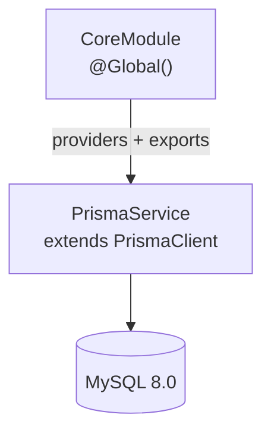

# Módulo: CoreModule

> **Ruta/Namespace:** `src/core/module.ts`
> **Criticidad:** 🔴 Alta
> **Estado:** Activo

## Propósito

Módulo global (`@Global()`) de infraestructura. Provee `PrismaService` a toda la aplicación sin necesidad de reimportarlo en cada módulo de dominio. Es el único punto de acceso a la base de datos MySQL.

## Funcionalidades que expone

| Servicio | Descripción | Disponible globalmente |
|----------|-------------|:---------------------:|
| `PrismaService` | Cliente Prisma para MySQL | ✅ Sí |

## Dependencias

- **Depende de:** `PrismaService` → `@db` (Prisma Client generado)
- **Es usado por:** [[modulo-app]] y cualquier módulo de dominio futuro (vía inyección global)

## Diagrama

## Archivos fuente relevantes

- `src/core/module.ts` — definición del módulo
- `src/core/services/prisma.ts` — implementación de `PrismaService`
- `src/core/repositories/_index.ts` — 💀 vacío, pendiente de implementar

## Riesgos y deuda técnica

- ⚠️ `src/core/repositories/_index.ts` está vacío. El array `REPOSITORIES` en `CoreModule` está preparado pero sin contenido. Implementar repositorios antes de agregar lógica de negocio.
- ⚠️ El esquema Prisma (`prisma/schema.prisma`) no tiene modelos. `PrismaService` existe pero no puede acceder a ninguna tabla todavía.
