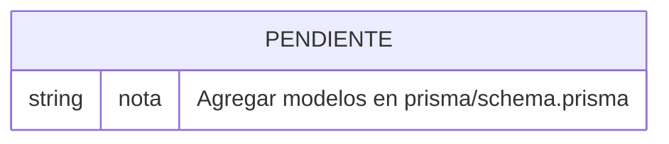

# Diagrama ER global

> [!warning] Sin modelos definidos
> El esquema Prisma (`prisma/schema.prisma`) está vacío. Este diagrama se completará cuando se definan los modelos de dominio.

## Placeholder

## Instrucciones para actualizar

1. Definir los modelos en `prisma/schema.prisma`
2. Ejecutar `npm run prisma:migrate`
3. Actualizar este diagrama con las entidades y relaciones correspondientes
4. Crear un archivo `docs/04-modelo-de-datos/entidad-<nombre>.md` por cada entidad relevante
