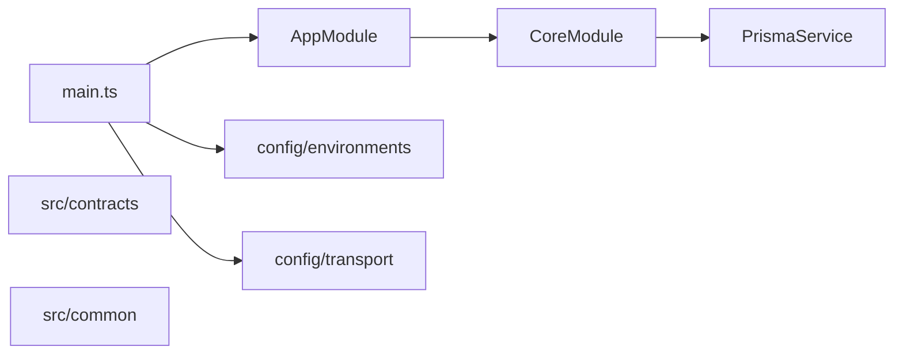
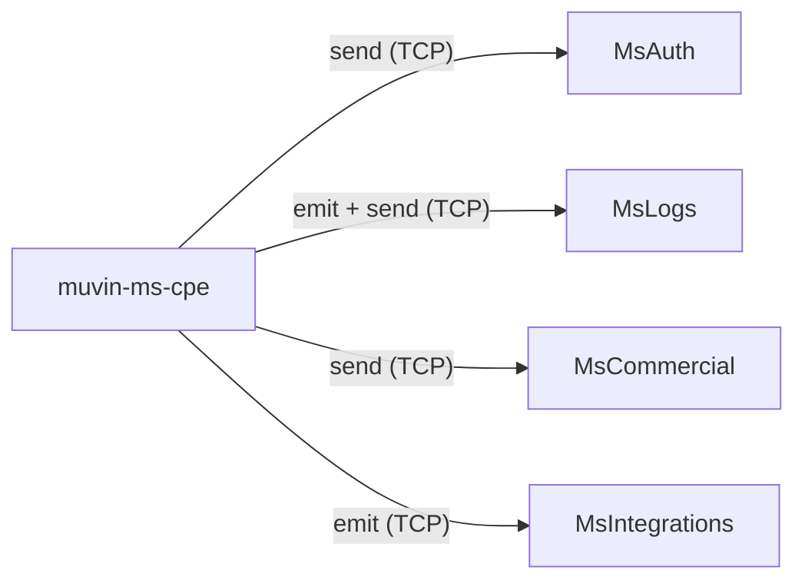

# Dependencias entre módulos internos

## Diagrama de dependencias internas

## Tabla de dependencias de módulos NestJS

| Módulo | Depende de | Es usado por |
|--------|-----------|--------------|
| `AppModule` | `CoreModule` | `main.ts` |
| `CoreModule` | `PrismaService` | `AppModule` (y cualquier módulo futuro vía global) |
| `PrismaService` | `@db` (Prisma Client generado) | `CoreModule` |

## Dependencias de path aliases

| Alias | Resuelve a | Usado actualmente por |
|-------|-----------|----------------------|
| `@common` | `src/common/_index` | Futuros módulos de dominio |
| `@config` | `src/config/_index` | `main.ts` |
| `@core` | `src/core/_index` | `AppModule` |
| `@contracts` | `src/contracts/_index` | Futuros handlers de mensajes |
| `@db` | `prisma/generated/client` | `PrismaService` |

## Dependencias circulares

No se detectaron dependencias circulares. La arquitectura es estrictamente jerárquica en su estado actual.

## Dependencias con microservicios externos (por contrato)

> [!warning] Dependencias externas aún no activas
> Los contratos en `src/contracts/` definen las interfaces pero **ningún `ClientProxy` está implementado aún**. Las dependencias externas se activarán cuando se implementen los módulos de dominio.
