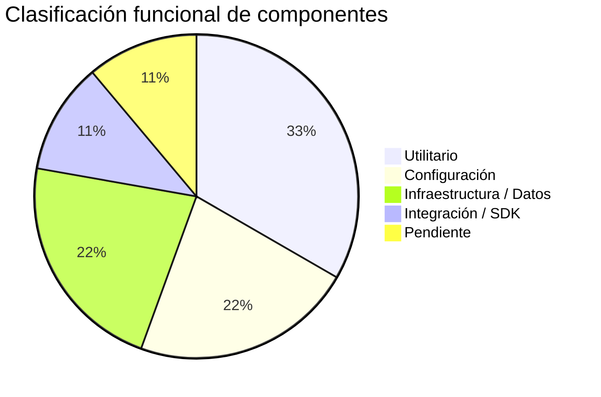
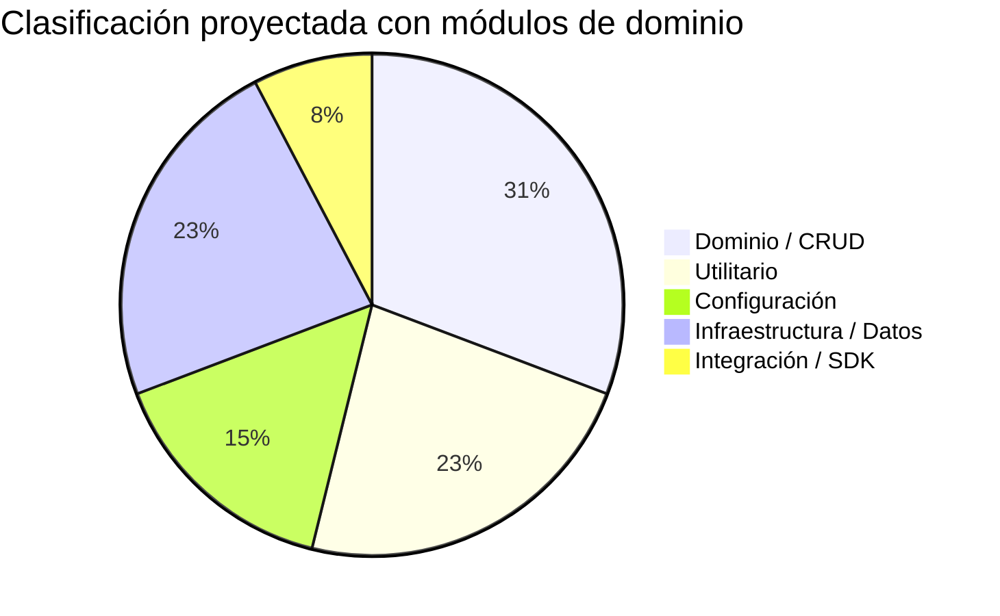

# Clasificación funcional de módulos

> **Estado del proyecto:** Base estructural implementada. Sin módulos de dominio aún.

## Clasificación actual

| Componente | Tipo funcional | Estado | Descripción breve |
|------------|---------------|--------|-------------------|
| `AppModule` | Configuración | ✅ Activo | Módulo raíz; solo ensambla el CoreModule |
| `CoreModule` | Utilitario / Infraestructura | ✅ Activo | Módulo global; provee PrismaService |
| `PrismaService` | Infraestructura / Datos | ✅ Activo | Cliente de base de datos MySQL |
| `src/contracts/` | Integración / SDK de tipos | ✅ Activo | Contratos de comunicación inter-microservicios |
| `src/common/cmd/` | Utilitario | ✅ Activo | Constantes de message patterns |
| `src/common/functions/` | Utilitario | ✅ Activo | Helpers de respuesta y logging |
| `src/common/interfaces/` | Utilitario / Tipos | ✅ Activo | Interfaces compartidas del sistema |
| `src/config/` | Configuración | ✅ Activo | Validación de entorno y transporte |
| `src/core/repositories/` | Datos | 🚧 Pendiente | Vacío — repositorios no implementados |

## Distribución por tipo

## Distribución esperada al completar features

> [!warning] Proyecto en estado inicial
> El microservicio tiene la estructura base completa pero **ningún módulo de dominio implementado**. El esquema Prisma está vacío, los repositorios están pendientes, y no hay `@MessagePattern` handlers registrados.
