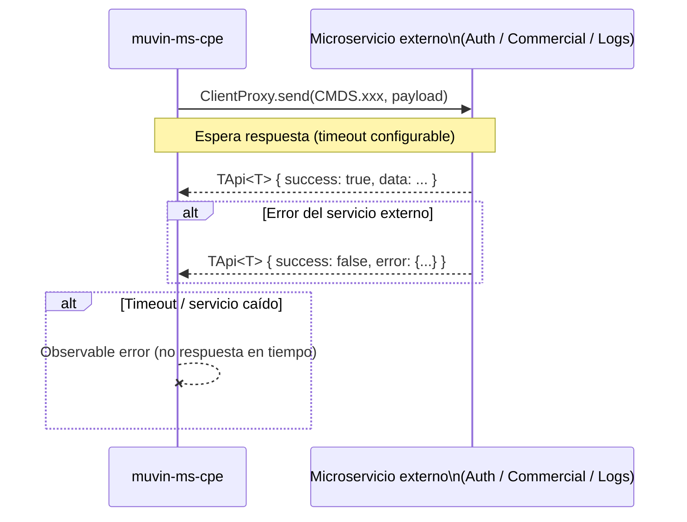
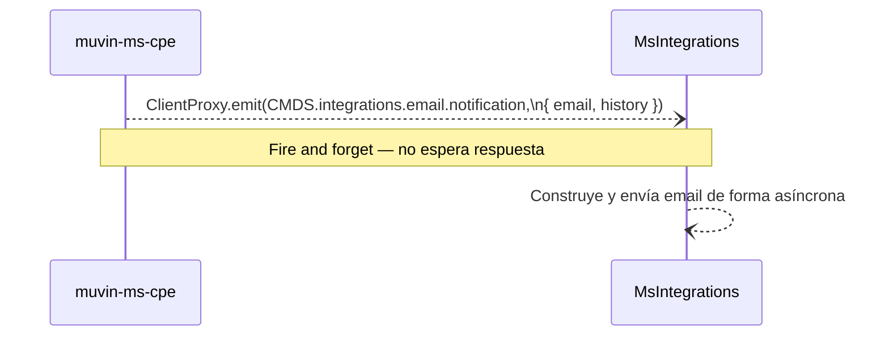

# Índice de flujos transversales

> [!warning] Sin flujos de dominio implementados aún
> No hay handlers `@MessagePattern` implementados en este microservicio. Los flujos end-to-end de negocio se documentarán aquí a medida que se desarrollen las features.

## Flujo de arranque del microservicio

```mermaid
flowchart TD
    A([Inicio del proceso]) --> B[Cargar .env]
    B --> C{Validación Joi\nHOST · PORT · DATABASE_URL}
    C -->|Falla| D[❌ Error fatal\nProceso termina con stack trace]
    C -->|OK| E[NestFactory.createMicroservice\nTransport.TCP]
    E --> F[AppModule init\nLOG: AppModule Init]
    F --> G[CoreModule @Global init]
    G --> H[PrismaService conecta a MySQL]
    H --> I[🎧 Escuchando en HOST:PORT]
    I --> J{Mensaje TCP entrante}
    J -->|@MessagePattern registrado| K[Handler ejecuta]
    J -->|Patrón desconocido| L[Mensaje ignorado / sin respuesta]
```

## Flujo de comunicación con microservicios externos (patrón send)



## Flujo de notificación por email (patrón emit)


