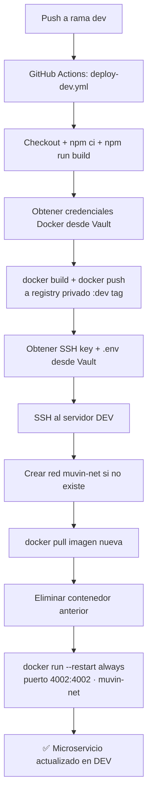

# Build y despliegue

## Comandos de desarrollo local

| Comando | Descripción |
|---------|-------------|
| `npm ci` | Instalar dependencias (reproducible) |
| `npm run prisma:generate` | Generar cliente Prisma (requerido antes del primer uso) |
| `npm run prisma:migrate` | Ejecutar migraciones de base de datos |
| `npm run start:dev` | Iniciar en modo watch (hot reload) |
| `npm run build` | Compilar TypeScript a `dist/` |
| `npm run start:prod` | Ejecutar el build compilado |
| `npm run lint` | Ejecutar ESLint con autofix |
| `npm run format` | Formatear con Prettier |

## Build Docker local

```bash
# Desde la raíz del proyecto
docker build -f docker/Dockerfile -t muvin-ms-cpe:local .
docker run -p 4002:4002 --env-file .env muvin-ms-cpe:local
```

## Levantar base de datos local

```bash
docker-compose -f docker/docker-compose.yml up -d
```

Levanta `mysql:8.0` en puerto `3306` con:
- Usuario: `root` / Contraseña: `muvin` (por defecto en compose)
- Base de datos: `db_commercial`

## Pipeline CI/CD — Deploy a DEV

**Trigger:** Push a rama `dev`



## Sincronización con repositorio externo

**Trigger:** Push o delete en rama `cap`

El workflow `sync-cap.yml` sincroniza automáticamente el repositorio con un target externo usando las credenciales `TARGET_URL`, `TARGET_USERNAME`, `TARGET_TOKEN` (desde GitHub Secrets).

## Dockerfile — multi-stage build

**Stage `builder`:**
1. `node:20-alpine` — instala todas las dependencias (`npm ci`)
2. Genera cliente Prisma (`npm run prisma:generate`)
3. Compila TypeScript (`nest build` → `dist/`)

**Stage `production`:**
1. `node:20-alpine` — imagen limpia
2. Crea usuario no-root `nestjs:nodejs` (uid 1001)
3. Instala solo dependencias de producción + genera Prisma client
4. Copia `dist/` desde el stage builder
5. `CMD: node dist/main.js`

> [!info] Imagen optimizada
> La imagen final no incluye TypeScript, ESLint, Prettier ni otras devDependencies. Solo el código compilado y las dependencias de producción.
