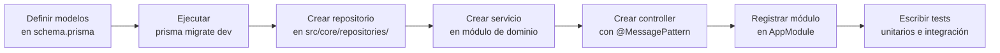

# Recomendaciones de modernización

> **Contexto:** El proyecto usa un stack moderno (NestJS v11, Prisma v6, TS v5.9). No hay deuda de modernización técnica. Las recomendaciones son sobre completitud y buenas prácticas para cuando se implementen las features.

## Recomendaciones inmediatas (antes de producción)

| # | Recomendación | Justificación | Esfuerzo |
|---|--------------|---------------|:--------:|
| 1 | Definir esquema Prisma y ejecutar migraciones | Sin modelos no hay funcionalidad | Bajo |
| 2 | Implementar al menos un módulo de dominio completo (module + controller + service + repository) como referencia | Establece el patrón para todos los demás | Medio |
| 3 | Agregar tests unitarios para servicios y helpers | Cobertura 0% actualmente; objetivo: 80%+ | Medio |
| 4 | Implementar health check | Necesario para monitoreo y liveness probe en producción | Bajo |
| 5 | Habilitar el servicio en `docker-compose.yml` | Facilita el desarrollo local integrado | Muy bajo |

## Recomendaciones a mediano plazo

| # | Recomendación | Justificación | Esfuerzo |
|---|--------------|---------------|:--------:|
| 6 | Implementar manejo de timeout y errores en cada `ClientProxy.send()` | Evita cuelgues si un microservicio externo no responde | Bajo |
| 7 | Considerar circuit breaker para llamadas a MS externos | Evita fallos en cascada | Medio |
| 8 | Agregar retry con backoff para operaciones `send()` críticas | Tolerancia a fallos transitorios de red | Bajo–Medio |
| 9 | Evaluar reemplazar `joi` por `zod` | Mejor integración con TypeScript, inferencia de tipos más potente | Bajo |
| 10 | Pinear digest de imagen Docker base | Reproducibilidad total del build | Muy bajo |

## Patrón recomendado para nuevos módulos de dominio

Al implementar cada feature, seguir este orden:



## Convención de estructura para módulos de dominio

```
src/
└── <dominio>/
    ├── module.ts            # @Module con imports, controllers, providers
    ├── controller.ts        # @Controller con @MessagePattern(CMDS.xxx)
    ├── service.ts           # Lógica de negocio
    └── dto/
        ├── create.dto.ts    # DTO de entrada para creación
        └── ...
```

El repositorio vive en `src/core/repositories/` y se inyecta globalmente vía `CoreModule`.
